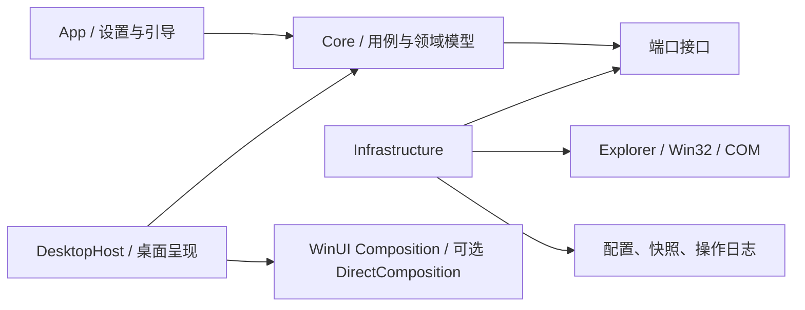
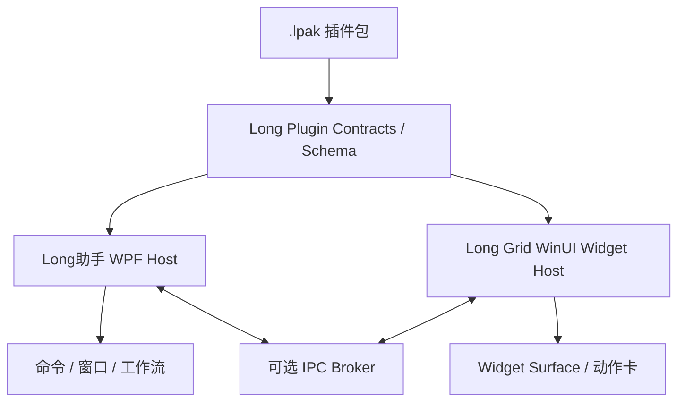

# Long Grid 技术架构与数据设计

状态：Proposal；需由 Phase 0 技术探针验证

## 1. 架构目标

- 把高风险 Windows 集成隔离在适配层。
- 领域逻辑不依赖 UI、注册表或 Shell COM，便于单测。
- 所有用户数据变更可追踪、可恢复、可迁移。
- 核心离线运行，网络能力作为可卸载扩展。

## 2. 推荐技术路线

- **语言/运行时**：C# + 当前受支持的 .NET LTS。
- **应用 UI**：WinUI 3 + Windows App SDK Stable。
- **系统互操作**：Win32、COM/WinRT 封装在 Infrastructure。
- **绘制**：先用 WinUI Composition；若透明层性能不达标，再验证 DirectComposition/Win2D。
- **持久化**：MVP 使用版本化 JSON + 原子写入；需要复杂查询时再引入 SQLite。
- **安装**：优先 MSIX；同时验证企业环境所需的离线/非商店安装。

微软当前将 WinUI 3 + Windows App SDK 推荐给新的原生 Windows 应用；Windows App SDK 同时允许现有桌面框架使用现代 API。版本应固定到开发时的 Stable 通道，而不是 Preview/Experimental。

这里的推荐只确定设置应用和共享窗口基础。P0-04/P0-05a 的原生窗口探针表明，在 100 容器场景下，“每显示器一个 HWND + 显式交互区域”能以更少 USER 资源实现准确跨进程空白区穿透，因此作为下一 DesktopHost 原型；Win+D、全屏、DPI、拖放和无障碍尚未通过，不能升级为最终技术栈决策。不得使用未文档化的 `Progman`/`WorkerW` 嵌入作为发布架构。

参考：[Windows 应用开发平台选择](https://learn.microsoft.com/windows/apps/)、[Windows App SDK](https://learn.microsoft.com/windows/apps/windows-app-sdk/)、[.NET 支持策略](https://dotnet.microsoft.com/platform/support/policy)

## 3. 模块边界



### LongGrid.Core

- `Container`、`DesktopItemRef`、`Workspace`、`LayoutSnapshot`、`Rule`。
- 规则匹配、冲突解决、布局映射、命令与撤销。
- 不引用 UI 框架和 Windows API。

### LongGrid.DesktopHost

- 每显示器桌面层/容器呈现。
- 命中测试、拖放、选择、键盘导航。
- 显示/隐藏、锁定、Peek 类快速访问。

### LongGrid.Infrastructure

- 显示器拓扑与 DPI 监听。
- Shell 项目解析、图标和缩略图。
- 全局快捷键、开机启动、托盘。
- 配置、快照、备份、日志。

### LongGrid.Shell

- 使用 Known Folder 与 Shell Namespace 枚举用户/Public/重定向桌面。
- 使用 `IShellItem`/`IShellItem2` 表示边界项。
- 使用 `SHChangeNotifyRegister` 接收 Shell 变更，并通过周期对账保证最终一致。
- 使用 `IShellItemImageFactory` 异步提取图标/缩略图。
- 使用 `IFileOperation` 执行经过批准的复制、移动、重命名和删除。

Shell COM 对象、PIDL、HWND 和原生句柄不得泄漏进 Core。

P0-01a/P0-01b 已验证物理目录与 Desktop Namespace 的只读发现和对账：当前机器上 96 个物理项目全部在 Shell 枚举中匹配，Shell 另有 9 个文件系统命名空间项目和 11 个纯虚拟项目。因此生产发现链必须以 Shell 为完整视图、以 Known Folder 扫描作为对账与降级来源；虚拟项目不得误判为可移动文件。

P0-01c 已验证当前 96 个物理桌面项目均可读取 Volume/File ID；临时沙箱内文件和目录重命名保持身份，复制产生新身份。72 个现存快捷方式目标与 `.lnk` 文件自身均为不同身份。生产模型应保存 Long Grid 领域 UUID、可变定位信息和可选文件系统稳定身份；快捷方式另存链接文件身份与可选目标身份。File ID 仅在同一计算机/卷语境内有效，不支持或返回全零时降级为规范化路径并保留不确定状态。

P0-02 已验证 Shell 会强烈合并高频变化：1,100 次沙箱操作每轮仅产生 1–4 条目录更新类通知，但静默窗口触发的全量对账均准确恢复 220 项最终状态。生产 `ShellChangeCoordinator` 必须把通知视为脏标记，以 750 ms 静默窗口合并突发变化，并用最大 3 s 延迟防止持续事件导致扫描饥饿；周期全量对账是最终事实来源。扫描结果必须携带代次号，过期结果不得覆盖较新的状态。

### LongGrid.App

- 首次引导、设置、规则编辑器、快照管理和诊断。
- 不直接执行文件系统副作用。

## 4. 核心数据模型

```json
{
  "schemaVersion": 1,
  "profileId": "default",
  "containers": [
    {
      "id": "01J...",
      "name": "当前项目",
      "appearance": {
        "color": "#334155",
        "opacity": 0.72,
        "collapsed": false
      },
      "placement": {
        "displayKey": "stable-display-key",
        "xDip": 32,
        "yDip": 48,
        "widthDip": 420,
        "heightDip": 300
      },
      "items": [
        {
          "id": "01J...",
          "kind": "folder",
          "target": "%USERPROFILE%\\Documents\\Project",
          "behavior": "reference"
        }
      ]
    }
  ]
}
```

设计规则：

- 坐标以 DIP 保存，同时保留显示器拓扑指纹。
- 路径支持环境变量规范化，但解析后必须重新校验边界。
- 项目 ID 不使用路径作为主键，避免重命名造成身份丢失。
- 未识别字段应尽可能保留，方便向前/向后迁移。
- 配置不保存文件内容；敏感路径在诊断导出时脱敏。

## 5. 布局恢复算法

1. 收集当前显示器的稳定属性：设备标识、工作区、方向、DPI 和相对拓扑。
2. 查找完全匹配的快照；若无，则按相似度选择最近拓扑。
3. 坐标从原工作区 DIP 映射到目标工作区。
4. 对不可见容器执行最小位移纠正，不重新洗牌全部布局。
5. 保存恢复报告，允许用户回退或交换屏幕内容。

禁止只用显示器数组序号或分辨率作为身份；它们在拔插、远程桌面和驱动更新时不稳定。

P0-07a 当前静态证据：双屏有效 DPI 为 192/240，三轮各 100 次枚举均只产生一个拓扑指纹，虚拟屏幕边界与显示器 Bounds 外接矩形一致且无原生资源增长。Core 指纹已经做到枚举顺序和虚拟桌面整体平移无关。

P0-07b1 已用 `QDC_ONLY_ACTIVE_PATHS | QDC_VIRTUAL_MODE_AWARE` 补齐 CCD source/target 路径：三轮各 100 次均取得 2 条活动路径，与 2 个 monitor 一一映射，source mode Bounds 2/2 一致，路径/拓扑指纹稳定且无资源增长。生产适配器必须保留缓冲不足有界重试；adapter LUID/target ID 只用于会话关联，monitor device path 的散列也不得进入日志。负坐标、旋转变化、缩放/拔插/RDP、`WM_DPICHANGED` 和恢复事务仍需 P0-07b2，完成前不能启用无人确认的自动布局恢复。

P0-07b2a 已实现纯 Core 恢复规划：只有拓扑指纹等价、全部精确身份映射且没有可见性纠正时才产生 `Automatic`；DPI/工作区/方向变化、唯一相似映射或最小位移产生 `ReviewRequired`；缺屏和对称歧义产生 `Blocked`。容器以工作区相对 DIP 保存，在目标 DPI 下转换为物理像素；规划器只生成 requested/proposed 差异，不提交窗口变化。事件合并、真实动态矩阵和 Region/Composition/UIA 同代事务仍由 P0-07b2b 验证。

P0-07b2b1 已实现纯 Core 显示变化稳定器：默认以 750 ms 静默期合并事件，要求相隔至少 250 ms 的两次一致指纹，并以 10 s 总截止时间阻断持续抖动。每个信号递增代次；旧查询、旧计划和 Ready 后漏通知产生的变化都不能覆盖新状态。睡眠或会话不可用时进入 Paused，恢复后从新代次重新采样。真实消息窗口、后台 CCD 调度和窗口事务仍由 P0-07b2b2 验证。

P0-07b2b2a 已建立真实隐藏顶层消息窗口，接入公开显示/DPI/设备/电源/WTS 消息，并把 CCD/monitor/DPI 快照放到单一专用线程；completion 通过私有 `WM_APP` 返回并校验代次。三轮静态观察均以两次后台快照进入 Ready，WTS/窗口类成对注销，USER/GDI/进程句柄回到稳定基线。线程池不用于创建 DPI 探测 HWND，避免工作线程消息队列使 USER 资源上限漂移。真实动态事件和窗口事务仍由 P0-07b2b2b 验证。

P0-07b2b2b1 已建立纯 Core 布局事务协调器：Blocked 和未批准的 ReviewRequired 在触碰窗口前拒绝；提交前、原位置快照后、批量应用后和最终验证后均核对显示代次。适配器批量应用后必须重新读取每个容器的物理像素 Bounds；应用失败、Bounds 不一致或代次过期都会补偿回滚，并再次读取验证回滚。`Begin/Defer/EndDeferWindowPos` 只作为 Win32 同刷新周期批量适配机制，不被视为原子业务事务。真实 HWND 适配器、Region/Composition/UIA 同代更新和硬件动态矩阵仍由 P0-07b2b2b2 验证。

P0-07b2b2b2a 已用两个始终隐藏、同线程、探针自有的顶层 HWND 验证 Win32 批量适配器。适配器按官方合同沿用每次 `DeferWindowPos` 返回的新句柄，使用 `SWP_NOACTIVATE | SWP_NOZORDER | SWP_NOOWNERZORDER`，并以 `GetWindowRect` 复读物理像素 Bounds。三轮均完成正常提交、幂等跳过、提交后代次失效回滚和真实单窗部分变更后的补偿回滚；负坐标、焦点、非 topmost/ToolWindow 样式和资源闭环通过。真实 `DeferWindowPos`/`EndDeferWindowPos` 资源失败没有被制造，Region/Composition/UIA 与硬件动态矩阵仍由 P0-07b2b2b2b 验证。

P0-07b2b2b2b1 已验证两个隐藏自有 HWND 的真实 Window Region 事务。每次提交前用 `GetWindowRgn` 获取独立副本；`SetWindowRgn` 成功后立即放弃调用方所有权，回滚验证使用转移前另行复制的 HRGN，绝不读取已转移句柄。Region 是逐窗立即生效而非批量原子 API，因此任何中途失败或代次过期都会恢复全部窗口并逐一 `EqualRgn` 验证；窗口销毁前显式设为 NULL Region。DirectComposition 的 device `Commit/WaitForCommitCompletion` 和真实 UIA provider 发布仍由 P0-07b2b2b2b2 验证。

P0-07b2b2b2b2 已在隐藏自有 HWND 上建立真实 DirectComposition device/target/visual 和 `IRawElementProviderSimple`。新 Root 必须完成 `Commit/WaitForCommitCompletion` 且显示 generation 仍有效，才能一次替换不可变 UIA 快照；若 Commit 后 generation 失效，则重新提交旧 Root、恢复旧 HWND Bounds，且不发布新 UIA generation。真实 `AutomationElement` 客户端已复读 generation、AutomationId 和物理屏幕 BoundingRectangle。该结果不把 Bounds、Region、DComp 与 UIA 描述为共同的系统原子事务；四层生产编排和硬件动态矩阵仍由 P0-07b2b2b2b3 验证。

P0-07b2b2b2b3 已建立固定 `Bounds → Region → Composition → UI Automation` 的复合协调器。事务先关闭输入并捕获全部快照；每层 Apply 后局部验证，全部应用后再做四层最终复读。任一层失败或 generation 失效时，从当前失败层开始逆序 Restore；所有 Restore 完成后才能正序 VerifyRestored，因为 UIA HWND Provider 的 BoundingRectangle 依赖最终 Bounds。补偿或输入重开失败时保持输入关闭并隐藏宿主。隐藏真实 HWND 的四层强制失败和紧急隐藏已通过；后续验证拆分为自动化 b4a 与人工受控 b4b。

P0-07b2b2b2b4a 已在短时可见、alpha=1、非激活且非 Topmost 的自有 HWND 上验证真实输入门。复杂 Window Region 开启时两个容器岛 `2/2` 命中宿主，空 Region 关闭时 `2/2` 精确穿透到创建前的外部进程 HWND，重开后 `2/2` 恢复；不移动光标或注入输入。每显示器 HWND 作为 `IRawElementProviderFragmentRoot`，容器作为 Group Fragment，真实 `AutomationElement` Raw View 客户端验证父子/兄弟导航、稳定不透明 RuntimeId、AutomationId 和物理屏幕 Bounds。输入关闭时 Fragment 仍可读但 `IsEnabled=false`，根的点分派返回空，UIA 点查询不得返回子 Fragment。Narrator、真实输入与显示动态矩阵继续由 P0-07b2b2b2b4b 人工验证。

P0-07b2b2b2b4b1 在既有隐藏消息窗口上增加受控矩阵验收层。固定场景把 scale/rotate/attach/detach/projection/lock-RDP/sleep-resume 映射为允许的公开消息组合；窗口过程仍只记录变化并调度后台快照，不执行系统修改。最终只有消息窗口/WTS/资源生命周期闭环、预期事件出现且稳定器回到 Ready 才为 `Observed Pass`；缺事件为 `Inconclusive`，采样或生命周期失败为 `Fail`。默认 JSON 不包含硬件、显示器、会话或拓扑标识。自动 baseline 和无事件防假阳性已通过；真实场景与 Narrator/输入继续由 b4b2 执行。

P0-04/P0-05b1 已建立首个 GDI 系统色的可见 DesktopHost 交互切片：一个 ToolWindow 内含 List 容器和三个内存项目，统一处理鼠标选择、Tab/方向键、Enter/Space Invoke 与 Esc 退出。窗口初次用 `SWP_NOACTIVATE` 展示但不永久设置 `WS_EX_NOACTIVATE`，因此初次检查点不抢焦点，同时允许用户或辅助技术显式聚焦。真实 UIA 客户端已验证 Pane/List/ListItem 树、Selection/SelectionItem/Invoke Pattern 和 Selection/Invoke 事件；三轮资源精确闭环。原型不读桌面、不打开外部内容，最终 DirectComposition 视觉、DPI/高对比和人工输入/Narrator/系统表面矩阵仍未通过。

## 6. 规则引擎

```text
事实采集 → 条件匹配 → 优先级排序 → 冲突检测 → 计划（Plan）
         → 用户/策略批准 → 执行（Apply）→ 操作日志 → Undo
```

- Plan 是纯数据，不产生副作用。
- Apply 使用幂等命令，重复执行不会重复添加或移动。
- 多规则命中默认报冲突；用户可设置显式优先级。
- 文件移动与视觉归类是不同动作类型，权限和确认分开。

## 7. 可靠性设计

- 配置写入：`new` 临时文件 → flush → 校验反序列化 → 原子替换 → 保留轮转备份。
- 单实例：第二实例只向主实例发送激活命令。
- 启动恢复：检测上次非正常退出，先加载最后有效快照。
- Explorer 重启：Shell 适配器重建句柄和订阅，不重建领域对象。
- 慢路径隔离：网络目录、缩略图和图标提取均异步、可取消、有超时。
- 降级：图标提取失败显示通用图标；网络离线显示状态而非阻塞 UI。

## 8. 可观测性

- 本地结构化日志，默认不记录完整路径和文件名。
- 环形日志按大小轮转，用户可清除。
- 诊断包必须预览内容并经用户主动导出。
- 指标：启动、唤起、布局恢复、规则计算、Shell 重连、异常类型。
- 公开测试前不启用未获同意的远程遥测。

## 9. Phase 0 技术探针

每个探针应是可丢弃的小项目，并记录视频、性能数据和结论。

| 探针 | 通过标准 |
|---|---|
| 桌面层与 Z-order | 原生命中/资源子探针通过；显示桌面、Win+D、全屏和 Explorer 重启后行为仍需验证 |
| 拖放与 Shell 项目 | 文件、文件夹、快捷方式、URL、OneDrive 占位均可识别 |
| 多显示器/DPI | 静态双屏混合 DPI 与 CCD 活动路径关联已测；100%–400%、负坐标、拔插/旋转/休眠后不丢失布局仍需验证 |
| 透明容器性能 | 100 容器/500 项目下拖动流畅、空闲预算达标 |
| 配置原子写入 | 强杀进程 1,000 次不产生不可恢复配置 |
| 全局快捷键 | 冲突可检测，失败有清晰降级 |
| MSIX/启动 | 安装、升级、卸载、开机启动符合系统约定 |

若 WinUI 3 桌面层无法满足性能或窗口语义，可保留 WinUI 3 设置应用，将 DesktopHost 改为 WPF 或原生 C++/DirectComposition；Core 和契约无需重写。

## 10. 任务栏扩展边界

Windows 提供的正式 Taskbar API 主要用于应用自己的按钮、进度、缩略图和覆盖图标，并不提供完整的系统任务栏换肤接口。Long Grid 不应把 Explorer 注入作为核心架构依赖。

建议分层：

1. `ThemeCoordinator`：读取系统主题/强调色，把 Long Grid 自有窗口与桌面容器协调到同一色板。
2. `TaskbarAppearance.Experimental`：可选、独立进程、按系统版本白名单运行；只提供可逆的透明/着色实验。
3. `LongBar`：若用户需要完全自定义的圆角、亚克力和项目启动器，使用我们自己的 AppBar/Dock 窗口，不宣称替换系统任务栏。

禁止默认启用进程注入、函数 Hook 或修改 Explorer 内部 XAML。详细依据见[桌面管理与任务栏美化深度审计](06-desktop-taskbar-audit.md)。

## 11. 小组件与跨产品插件平台

Long Grid 不应直接引用 Long助手的 WPF 宿主程序集。两个产品应共享版本化的 Manifest、包验证、能力名称和基础合同，各自实现宿主适配器：



兼容规则：

- 旧命令插件可由 Long Grid 包装成动作卡，不要求修改插件。
- Web 插件只有显式声明 Widget Surface 后，才允许嵌入桌面。
- 原生 WPF UI 不跨框架嵌入；默认显示启动卡或通过 IPC 打开原窗口。
- C# Script 只作为命令或数据提供者，不直接承载桌面 UI。
- Hybrid/Native 插件在完成进程隔离前只允许本地高信任安装。

详细审计和 Manifest 草案见[小组件与 Long助手插件兼容设计](07-widget-plugin-compatibility.md)。

## 12. 桌面呈现与文件所有权

Long Grid 必须显式区分：

1. `ReferenceContainer`：只保存引用，原文件和原生桌面图标不变。
2. `ManagedFolderContainer`：绑定真实目录，用户批准后通过 Shell 文件操作移动。
3. `NativeIconLayout`：通过 `IFolderView` 读取/调整原生图标位置的实验适配器。

前两者可以进入产品路线；第三种只有在不依赖 WorkerW、Explorer 注入和内部 XAML 的技术探针通过后才能承诺。

DesktopHost 使用状态机管理 `Hidden / DesktopPassive / DesktopEditing / Peek / Suspended / Recovering`。普通桌面状态不得置顶，Peek 才临时提升层级；全屏、锁屏和演示场景默认隐藏或降频。

详细实现依据见[核心 Windows 能力实现审计](08-core-windows-implementation-audit.md)。
