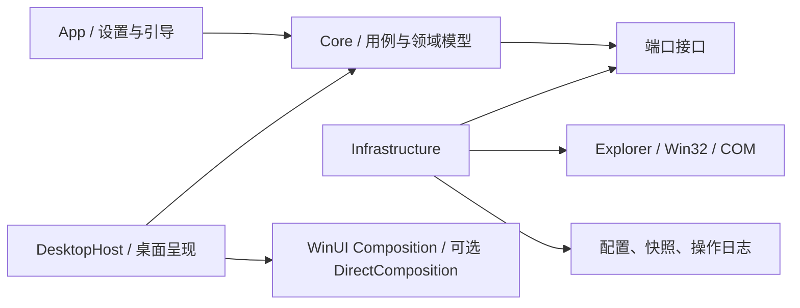
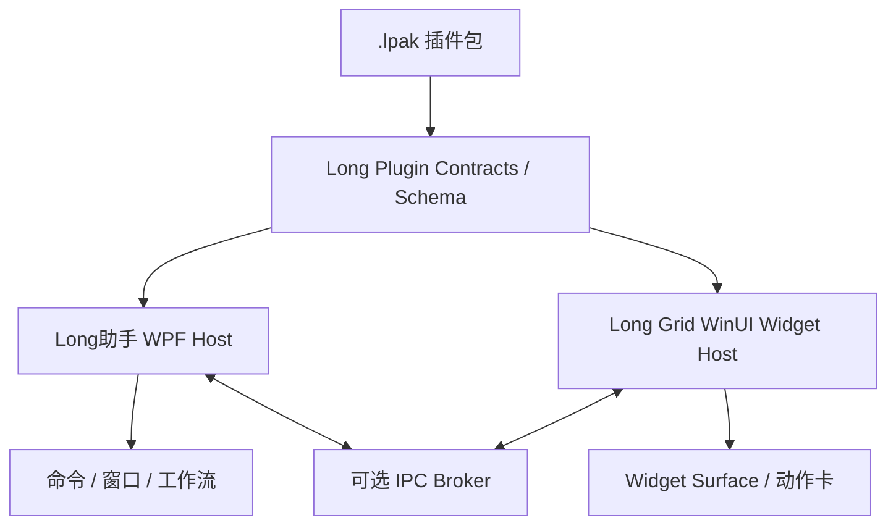

# Long Grid 技术架构与数据设计

状态：Proposal；需由 Phase 0 技术探针验证

## 1. 架构目标

- 把高风险 Windows 集成隔离在适配层。
- 领域逻辑不依赖 UI、注册表或 Shell COM，便于单测。
- 所有用户数据变更可追踪、可恢复、可迁移。
- 核心离线运行，网络能力作为可卸载扩展。

## 2. 推荐技术路线

- **语言/运行时**：C# + 当前受支持的 .NET LTS。
- **应用 UI**：WinUI 3 + Windows App SDK Stable。
- **系统互操作**：Win32、COM/WinRT 封装在 Infrastructure。
- **绘制**：先用 WinUI Composition；若透明层性能不达标，再验证 DirectComposition/Win2D。
- **持久化**：MVP 使用版本化 JSON + 原子写入；需要复杂查询时再引入 SQLite。
- **安装**：优先 MSIX；同时验证企业环境所需的离线/非商店安装。

微软当前将 WinUI 3 + Windows App SDK 推荐给新的原生 Windows 应用；Windows App SDK 同时允许现有桌面框架使用现代 API。版本应固定到开发时的 Stable 通道，而不是 Preview/Experimental。

这里的推荐只确定设置应用和共享窗口基础。P0-04/P0-05a 的原生窗口探针表明，在 100 容器场景下，“每显示器一个 HWND + 显式交互区域”能以更少 USER 资源实现准确跨进程空白区穿透，因此作为下一 DesktopHost 原型；Win+D、全屏、DPI、拖放和无障碍尚未通过，不能升级为最终技术栈决策。不得使用未文档化的 `Progman`/`WorkerW` 嵌入作为发布架构。

参考：[Windows 应用开发平台选择](https://learn.microsoft.com/windows/apps/)、[Windows App SDK](https://learn.microsoft.com/windows/apps/windows-app-sdk/)、[.NET 支持策略](https://dotnet.microsoft.com/platform/support/policy)

## 3. 模块边界



### LongGrid.Core

- `Container`、`DesktopItemRef`、`Workspace`、`LayoutSnapshot`、`Rule`。
- 规则匹配、冲突解决、布局映射、命令与撤销。
- 以不可变快照向 App 暴露运行模式和能力状态；快照不得携带 Shell/Win32 句柄、路径、执行委托或可变适配器。
- 不引用 UI 框架和 Windows API。

### LongGrid.DesktopHost

- 每显示器桌面层/容器呈现。
- 命中测试、拖放、选择、键盘导航。
- 显示/隐藏、锁定、Peek 类快速访问。

### LongGrid.Infrastructure

- 显示器拓扑与 DPI 监听。
- Shell 项目解析、图标和缩略图。
- 全局快捷键、开机启动、托盘。
- 配置、快照、备份、日志。

### LongGrid.Shell

- 使用 Known Folder 与 Shell Namespace 枚举用户/Public/重定向桌面。
- 使用 `IShellItem`/`IShellItem2` 表示边界项。
- 使用 `SHChangeNotifyRegister` 接收 Shell 变更，并通过周期对账保证最终一致。
- 使用 `IShellItemImageFactory` 异步提取图标/缩略图。
- 使用 `IFileOperation` 执行经过批准的复制、移动、重命名和删除。

Shell COM 对象、PIDL、HWND 和原生句柄不得泄漏进 Core。

P0-01a/P0-01b 已验证物理目录与 Desktop Namespace 的只读发现和对账：当前机器上 96 个物理项目全部在 Shell 枚举中匹配，Shell 另有 9 个文件系统命名空间项目和 11 个纯虚拟项目。因此生产发现链必须以 Shell 为完整视图、以 Known Folder 扫描作为对账与降级来源；虚拟项目不得误判为可移动文件。

P0-01c 已验证当前 96 个物理桌面项目均可读取 Volume/File ID；临时沙箱内文件和目录重命名保持身份，复制产生新身份。72 个现存快捷方式目标与 `.lnk` 文件自身均为不同身份。生产模型应保存 Long Grid 领域 UUID、可变定位信息和可选文件系统稳定身份；快捷方式另存链接文件身份与可选目标身份。File ID 仅在同一计算机/卷语境内有效，不支持或返回全零时降级为规范化路径并保留不确定状态。

P0-02 已验证 Shell 会强烈合并高频变化：1,100 次沙箱操作每轮仅产生 1–4 条目录更新类通知，但静默窗口触发的全量对账均准确恢复 220 项最终状态。生产 `ShellChangeCoordinator` 必须把通知视为脏标记，以 750 ms 静默窗口合并突发变化，并用最大 3 s 延迟防止持续事件导致扫描饥饿；周期全量对账是最终事实来源。扫描结果必须携带代次号，过期结果不得覆盖较新的状态。

### LongGrid.App

- 首次引导、设置、规则编辑器、快照管理和诊断。
- 单向消费 Core 状态快照，并把可见状态与机器可判定的 UIA 状态同时呈现。
- 不直接执行文件系统副作用。

## 4. 核心数据模型

```json
{
  "schemaVersion": 2,
  "profileId": "default",
  "savedDisplayTopology": [
    {
      "stableId": "sha256-stable-display-id",
      "bounds": { "left": 0, "top": 0, "width": 2560, "height": 1440 },
      "workArea": { "left": 0, "top": 0, "width": 2560, "height": 1400 },
      "effectiveDpi": 144,
      "rotation": "landscape",
      "isPrimary": true
    }
  ],
  "containers": [
    {
      "id": "01J...",
      "name": "当前项目",
      "appearance": {
        "color": "#334155",
        "opacity": 0.72,
        "collapsed": false
      },
      "placement": {
        "displayKey": "stable-display-key",
        "xDip": 32,
        "yDip": 48,
        "widthDip": 420,
        "heightDip": 300
      },
      "items": [
        {
          "id": "01J...",
          "kind": "folder",
          "target": "%USERPROFILE%\\Documents\\Project",
          "behavior": "reference"
        }
      ]
    }
  ]
}
```

设计规则：

- 坐标以 DIP 保存，同时保留显示器拓扑指纹。
- 路径支持环境变量规范化，但解析后必须重新校验边界。
- 项目 ID 不使用路径作为主键，避免重命名造成身份丢失。
- 未识别字段应尽可能保留，方便向前/向后迁移。
- 配置不保存文件内容；敏感路径在诊断导出时脱敏。

`LongGrid.Core.Configuration` 当前正式合同为 v2：在 v1 的最多 100 个容器/500 个项目、4 MiB UTF-8 JSON、有限 DIP/字符串边界、全局唯一对象 ID、未知字段保留和有限错误码之上，增加最多 32 个保存时显示器节点。节点只含脱敏 StableId、Bounds、WorkArea、有效 DPI、旋转和主屏标志；旧 v1 仅能相邻迁移为 v2 且明确不伪造拓扑。当前行为枚举仍只允许 `reference`，不把未批准的真实移动写入 schema；详细边界见[正式产品配置合同审计](28-product-configuration-contract-audit.md)与[v2 保存时显示拓扑合同审计](60-versioned-saved-display-topology-audit.md)。Core 合同本身不执行 I/O；正式磁盘适配器位于 `LongGrid.Infrastructure`。

2026-08-05 的产品状态投影切片进一步建立 UI 无关 `ProductWorkspaceState`：容器、外观、DIP/显示器放置和引用不再从 WinUI 控件反推；项目引用必须携带已解析 `DesktopCatalogEntry/DesktopItemIdentity`。投影器只接受 filesystem provider 和完全限定 canonical target，固定映射为 current-v1 reference，并经正式 serializer/validator 生成深快照；显示名称、SourceId、ParsingName、Volume/File ID 不进入 v1。保存工作流可直接接收该状态，但 MainWindow 仍零普通保存调用。v1 无法跨重启保留文件系统稳定身份，后续必须用当前 Catalog 解析 target 并显式表达 missing/unresolved；详见[产品工作区状态与 v1 投影审计](44-product-workspace-state-projection-audit.md)。

同日的反向解析切片随后以同一内部身份策略把 current-v1 与调用方提供的当前 Catalog 快照解析为 `Resolved/Missing/TypeChanged/Ambiguous/UnsupportedTarget`。解析前验证并深快照配置，随后验证整个 Catalog；目标重复即歧义，不按来源顺序、显示名或类型猜测。未解析引用没有 Catalog Entry，但保留原领域 ID、kind、target 与扩展字段，重投影不会自动删除或改绑。resolver 本身不枚举文件系统、不执行 I/O；产品 reducer 与 MainWindow 普通保存仍未接入。详见[配置到桌面 Catalog 解析审计](45-configuration-catalog-resolution-audit.md)。

同日的下一产品切片建立纯 `ProductWorkspaceReducer` 与 `ProductWorkspaceSaveStateMachine`。所有创建、重命名、外观/放置、锁定、添加/替换/移除引用操作先后经正式 projector/validator 复核并返回深快照；锁定容器禁止内容和布局修改，未解析引用删除必须显式确认，重新选择保留领域 ID 与未知字段。保存状态机以单调 revision 表达防抖等待、保存、成功、有限失败和重试，只允许最新防抖发出保存命令，并丢弃旧保存结果对当前 UI 状态的影响。它不包含计时器、I/O 或 WinUI；应用层控制器、关闭编排和保存 UIA 仍是下一门禁。详见[产品工作区 reducer 与连续保存状态审计](46-product-workspace-reducer-save-state-audit.md)。

后续 Infrastructure 切片以 `ProductWorkspaceSaveController` 编排纯状态机与正式保存工作流。Reducer 成功且 `Changed=true` 的状态在接受时立即投影为独立 v1 文档，随后用默认 400 ms、最大 10 秒且可替换的调度器防抖；新编辑取消旧等待但不撤销已接受保存，陈旧完成不覆盖最新状态。四类正式错误映射为产品失败，工作流重试快照不一致收敛为不可重试 `RetryUnavailable`。关闭会立即刷新最新等待状态并等待已接受操作，最新失败保留窗口，调用方超时只取消等待。控制器仍未注入 MainWindow；可见 presenter、UIA 和 ordinary save 继续受门禁。详见[产品工作区连续保存控制器审计](47-product-workspace-save-controller-audit.md)。

下一 App 切片把该 controller 作为 App 唯一普通保存编排所有权：后台快照事件经 DispatcherQueue 回到 UI 线程；关闭用 controller 强制刷新、失败阻断、5 秒等待和安全释放；MainWindow 只获得有限 Retry 委托。概览保存卡以 5 个新 AutomationId 映射 Clean/Waiting/Saving/Retrying/Saved/Failed，UIA 只含枚举、revision 和重试标志。状态卡无 Storyboard/Transition，形成静态 Reduced Motion 基线。匿名练习仍零提交，App/MainWindow 没有普通 SaveAsync/EnqueueAsync。真实 UIA 修正后复跑受残留无窗口单实例污染而 Inconclusive，详见[App 保存状态与关闭接线审计](48-app-product-save-status-ui-audit.md)。

正式产品会话加载层进一步把 `ProductConfigurationLoadResult` 与显式 `ProductWorkspaceCatalogSnapshot` 合成为有限 `ProductWorkspaceSessionSnapshot`。Catalog 的 `Unavailable` 与权威 `Available([])` 是不同类型状态：前者停在 AwaitingCatalog 且不分类引用，后者才允许 resolver 得出 Missing。App 在启动、恢复和导入复读后统一刷新存储提示与产品会话；会话覆盖 Loading/NoSavedConfiguration/AwaitingCatalog/Ready/RecoveredBackupReadOnly/SafeMode/Failed，UIA 仅暴露来源枚举、只读标志及匿名解析计数。当前开发期 Catalog 仍断开，普通提交继续为零，详见[正式产品工作区会话加载审计](49-product-workspace-session-load-audit.md)。

只读物理 Desktop Catalog 层把 P0-01a 的用户桌面/公共桌面第一层枚举晋升为 Infrastructure reader，并用 controller 提供递增 generation、并发 latest-wins、有限取消和关闭排空。只有两个来源都完整 Ready 才发布 Authoritative Catalog；Partial/Missing/AccessDenied/IoFailure 收集项只作匿名诊断，转换到产品会话时仍为 Unavailable。App 自动首刷并提供显式刷新，配置加载与目录刷新任意顺序汇合；Core 只在 Ready 时报告 ConnectedReadOnly，文件操作仍 DisabledBySafetyPolicy。Shell COM 虚拟项继续留在 Spike，详见[只读物理桌面目录与刷新代次审计](50-readonly-physical-desktop-catalog-audit.md)。

DesktopHost 产品接线从 Stage 106 起由 App composition root 唯一持有 `ProductDesktopHostLifecycleController`。Core 只判定严格默认关闭的开发 Feature Policy，Infrastructure 只向 App 报告 `DisabledBySafetyPolicy`、`AwaitingHost`、`Completed`、generation、连接布尔值和窗口数量；presentation 不接收 HWND、进程/线程 ID 或路径。A1 尚不创建原生宿主或方格窗口；`LONGGRID_ENABLE_DESKTOP_HOST=1` 只把状态推进到等待宿主。Catalog 刷新与生命周期更新合并进同一 Runtime snapshot，互不覆盖。关闭时 App 先退订并释放生命周期控制器，再释放显示拓扑、Catalog 与保存控制器。详见[DesktopHost 生命周期与默认关闭开关审计](106-desktop-host-lifecycle-feature-flag-audit.md)。

Stage 116 / B6a 又让 App composition root 唯一持有 `ProductDesktopInteractionDevelopmentController`。它只有在 DesktopHost 与 Interaction 两个精确开发 opt-in 同时成立时进入 Passive；精确的进程级 emergency-disable 优先于两个开启值。控制器把失焦、Win+D、全屏、锁屏/断开、RDP、Explorer 重启与 shutdown 收敛为 fail-closed 暂停/完成，并只在 NativeHost、只读 UIA、Passive window contract 与三类正 generation 完整复核后恢复 Passive。B6a 没有显式交互入口、没有构造原生 Surface adapter，也没有文件 API；正式 HWND 仍保持只读穿透。详见[受控开发态交互 Composition Root 基础审计](116-controlled-development-interaction-composition-root-audit.md)。

Stage 117 / B6b 在同一控制器后接入 `ProductDesktopHostPassiveSurfaceModeAdapter`。双 opt-in 路径的产品 HWND 先以不可见、空 Window Region 创建，待全部窗口进入产品 registry 且 generation/ownership/UIA 证明完整后，adapter 才恢复正式 Region 并 `SW_SHOWNOACTIVATE` 发布 Passive。adapter 只接受相同 registry generation 的 Passive/Hidden，`ApplyExplicit` 固定拒绝；任何批量复核失败都尝试隐藏全部 Surface。生命周期在 registry 注销和 HWND 销毁前先 detach/hide。Host-only 开发预览保持原有只读可见行为；两条路径的 `WM_NCHITTEST` 都继续返回 `HTTRANSPARENT`。详见[产品 Hidden/Passive Surface 生命周期审计](117-product-hidden-passive-surface-lifecycle-audit.md)。

Stage 118 / B6c1 增加独立系统表面观察器。它只读取公开的 Shell/前台、全屏通知、远程会话、SessionSwitch 和电源状态，把变化收敛为七种有限事件与进程内单调序号；不枚举窗口、不读取标题/路径、不使用全局 Hook、SendInput 或 Explorer 内部挂接。危险或未知事件让产品 adapter 立即 Hidden，并发布 `SuspendedSystemSurface`；恢复要求连续两个安全样本，再以当前 workspace/topology/window-registry generation 重建证据并复核只读 UIA/Passive 合同。无 Surface 的启动期事件只消费序号，不制造 Fault。观察器在 shutdown 前退订并释放 Timer。正式 HWND 仍为 `HTTRANSPARENT`，Explicit/Intent/Selection/文件操作仍未接线。详见[系统表面事件与 Fail-Closed 桥审计](118-system-surface-event-fail-closed-bridge-audit.md)。

Stage 119 / B6c2 在 App composition root 中构造第三重默认关闭的 Intent 准备桥。除 Host/Interaction 外，bridge opt-in 与人工会话确认也必须精确为 `1`。生命周期仅在 ReadyReadOnly/Passive 证明成立时，把一秒内、逐动作确认、单调序号、唯一显示器与唯一未锁定方格命中的请求交给既有 HitTest/Intent Factory；结果最长 5 秒并绑定 workspace/topology/window-registry 与 bridge generation。新动作、系统信号、Surface 释放、证据漂移、超时和关闭都会失效准备。App/MainWindow 没有调用准备入口，bridge 不调用 Admission/Surface transaction，正式 HWND 仍 `HTTRANSPARENT` 且 adapter 固定拒绝 Explicit。详见[产品 Intent 准备与人工会话门禁审计](119-product-intent-preparation-manual-session-gate-audit.md)。

未解析引用审查层随后把会话中的非 Resolved 项投影为稳定匿名序号，并为每项签发包含 Catalog generation、edit revision、内部领域 ID 与预期解析状态的 token。Keep 不产生 edit；Replace 必须显式选择且当前 Catalog 身份唯一；Remove 必须明确确认。Gate 在每次预演时复核代际、修订、对象状态、锁定及候选，返回有限失败或 reducer 深快照。WinUI 在对话框打开前捕获 token/候选，目录刷新不能让旧选择静默指向新对象。当前只做 dry-run，App 不替换 session、不递增 revision、不调用普通 submit，也不触碰桌面文件，详见[未解析引用审查与双版本门禁审计](51-unresolved-reference-review-gate-audit.md)。

正式编辑提交层将 Gate/Reducer 的成功结果交给 Infrastructure `ProductWorkspaceCommitCoordinator`：校验 → v1 projection → 唯一 controller Submit → edit revision 推进的顺序不可绕过。引用编辑和容器编辑共享同一把锁与同一单调 revision，外部配置加载也推进该 revision。controller 接受后，App 用返回 Document 立即替换内存配置基线并重新解析 session/review，因此防抖期间的 Catalog 刷新不会恢复旧状态。Waiting/Saving/Failed 期间导入/导出关闭；桌面文件 API 仍未接入。详见[引用编辑正式保存提交审计](52-reference-edit-save-submission-audit.md)。

正式可视化不直接消费配置 Document 或 Catalog。`ProductWorkspaceReadModel` 先用 v1 projector 验证 session state，再输出不含持久化路径、内部 ID、布局显示身份和文件身份的只读快照；App 负责把该快照映射为本地化文本，MainWindow 只绑定 presentation。已解析名称属于用户可见内容并进入辅助功能名称，未解析引用保持序号匿名，UIA ItemStatus 只记录有限计数。详见[正式工作区只读视图审计](53-formal-workspace-readonly-view-audit.md)。

容器锁定/折叠同样经统一提交协调器：显式解锁复用 reducer 的锁定例外，折叠复用受锁保护的 Appearance 更新，因此锁定容器必须先解锁才能折叠。presentation 只持有序号、锁定/折叠布尔值和 edit revision，不持有内部身份。详见[正式容器锁定与折叠提交审计](55-container-lock-collapse-commit-audit.md)。

## 5. 布局恢复算法

1. 收集当前显示器的稳定属性：设备标识、工作区、方向、DPI 和相对拓扑。
2. 查找完全匹配的快照；若无，则按相似度选择最近拓扑。
3. 坐标从原工作区 DIP 映射到目标工作区。
4. 对不可见容器执行最小位移纠正，不重新洗牌全部布局。
5. 保存恢复报告，允许用户回退或交换屏幕内容。

禁止只用显示器数组序号或分辨率作为身份；它们在拔插、远程桌面和驱动更新时不稳定。

P0-07a 当前静态证据：双屏有效 DPI 为 192/240，三轮各 100 次枚举均只产生一个拓扑指纹，虚拟屏幕边界与显示器 Bounds 外接矩形一致且无原生资源增长。Core 指纹已经做到枚举顺序和虚拟桌面整体平移无关。

P0-07b1 已用 `QDC_ONLY_ACTIVE_PATHS | QDC_VIRTUAL_MODE_AWARE` 补齐 CCD source/target 路径：三轮各 100 次均取得 2 条活动路径，与 2 个 monitor 一一映射，source mode Bounds 2/2 一致，路径/拓扑指纹稳定且无资源增长。生产适配器必须保留缓冲不足有界重试；adapter LUID/target ID 只用于会话关联，monitor device path 的散列也不得进入日志。负坐标、旋转变化、缩放/拔插/RDP、`WM_DPICHANGED` 和恢复事务仍需 P0-07b2，完成前不能启用无人确认的自动布局恢复。

P0-07b2a 已实现纯 Core 恢复规划：只有拓扑指纹等价、全部精确身份映射且没有可见性纠正时才产生 `Automatic`；DPI/工作区/方向变化、唯一相似映射或最小位移产生 `ReviewRequired`；缺屏和对称歧义产生 `Blocked`。容器以工作区相对 DIP 保存，在目标 DPI 下转换为物理像素；规划器只生成 requested/proposed 差异，不提交窗口变化。事件合并、真实动态矩阵和 Region/Composition/UIA 同代事务仍由 P0-07b2b 验证。

P0-07b2b1 已实现纯 Core 显示变化稳定器：默认以 750 ms 静默期合并事件，要求相隔至少 250 ms 的两次一致指纹，并以 10 s 总截止时间阻断持续抖动。每个信号递增代次；旧查询、旧计划和 Ready 后漏通知产生的变化都不能覆盖新状态。睡眠或会话不可用时进入 Paused，恢复后从新代次重新采样。真实消息窗口、后台 CCD 调度和窗口事务仍由 P0-07b2b2 验证。

P0-07b2b2a 已建立真实隐藏顶层消息窗口，接入公开显示/DPI/设备/电源/WTS 消息，并把 CCD/monitor/DPI 快照放到单一专用线程；completion 通过私有 `WM_APP` 返回并校验代次。三轮静态观察均以两次后台快照进入 Ready，WTS/窗口类成对注销，USER/GDI/进程句柄回到稳定基线。线程池不用于创建 DPI 探测 HWND，避免工作线程消息队列使 USER 资源上限漂移。真实动态事件和窗口事务仍由 P0-07b2b2b 验证。

P0-07b2b2b1 已建立纯 Core 布局事务协调器：Blocked 和未批准的 ReviewRequired 在触碰窗口前拒绝；提交前、原位置快照后、批量应用后和最终验证后均核对显示代次。适配器批量应用后必须重新读取每个容器的物理像素 Bounds；应用失败、Bounds 不一致或代次过期都会补偿回滚，并再次读取验证回滚。`Begin/Defer/EndDeferWindowPos` 只作为 Win32 同刷新周期批量适配机制，不被视为原子业务事务。真实 HWND 适配器、Region/Composition/UIA 同代更新和硬件动态矩阵仍由 P0-07b2b2b2 验证。

P0-07b2b2b2a 已用两个始终隐藏、同线程、探针自有的顶层 HWND 验证 Win32 批量适配器。适配器按官方合同沿用每次 `DeferWindowPos` 返回的新句柄，使用 `SWP_NOACTIVATE | SWP_NOZORDER | SWP_NOOWNERZORDER`，并以 `GetWindowRect` 复读物理像素 Bounds。三轮均完成正常提交、幂等跳过、提交后代次失效回滚和真实单窗部分变更后的补偿回滚；负坐标、焦点、非 topmost/ToolWindow 样式和资源闭环通过。真实 `DeferWindowPos`/`EndDeferWindowPos` 资源失败没有被制造，Region/Composition/UIA 与硬件动态矩阵仍由 P0-07b2b2b2b 验证。

P0-07b2b2b2b1 已验证两个隐藏自有 HWND 的真实 Window Region 事务。每次提交前用 `GetWindowRgn` 获取独立副本；`SetWindowRgn` 成功后立即放弃调用方所有权，回滚验证使用转移前另行复制的 HRGN，绝不读取已转移句柄。Region 是逐窗立即生效而非批量原子 API，因此任何中途失败或代次过期都会恢复全部窗口并逐一 `EqualRgn` 验证；窗口销毁前显式设为 NULL Region。DirectComposition 的 device `Commit/WaitForCommitCompletion` 和真实 UIA provider 发布仍由 P0-07b2b2b2b2 验证。

P0-07b2b2b2b2 已在隐藏自有 HWND 上建立真实 DirectComposition device/target/visual 和 `IRawElementProviderSimple`。新 Root 必须完成 `Commit/WaitForCommitCompletion` 且显示 generation 仍有效，才能一次替换不可变 UIA 快照；若 Commit 后 generation 失效，则重新提交旧 Root、恢复旧 HWND Bounds，且不发布新 UIA generation。真实 `AutomationElement` 客户端已复读 generation、AutomationId 和物理屏幕 BoundingRectangle。该结果不把 Bounds、Region、DComp 与 UIA 描述为共同的系统原子事务；四层生产编排和硬件动态矩阵仍由 P0-07b2b2b2b3 验证。

P0-07b2b2b2b3 已建立固定 `Bounds → Region → Composition → UI Automation` 的复合协调器。事务先关闭输入并捕获全部快照；每层 Apply 后局部验证，全部应用后再做四层最终复读。任一层失败或 generation 失效时，从当前失败层开始逆序 Restore；所有 Restore 完成后才能正序 VerifyRestored，因为 UIA HWND Provider 的 BoundingRectangle 依赖最终 Bounds。补偿或输入重开失败时保持输入关闭并隐藏宿主。隐藏真实 HWND 的四层强制失败和紧急隐藏已通过；后续验证拆分为自动化 b4a 与人工受控 b4b。

P0-07b2b2b2b4a 已在短时可见、alpha=1、非激活且非 Topmost 的自有 HWND 上验证真实输入门。复杂 Window Region 开启时两个容器岛 `2/2` 命中宿主，空 Region 关闭时 `2/2` 精确穿透到创建前的外部进程 HWND，重开后 `2/2` 恢复；不移动光标或注入输入。每显示器 HWND 作为 `IRawElementProviderFragmentRoot`，容器作为 Group Fragment，真实 `AutomationElement` Raw View 客户端验证父子/兄弟导航、稳定不透明 RuntimeId、AutomationId 和物理屏幕 Bounds。输入关闭时 Fragment 仍可读但 `IsEnabled=false`，根的点分派返回空，UIA 点查询不得返回子 Fragment。Narrator、真实输入与显示动态矩阵继续由 P0-07b2b2b2b4b 人工验证。

P0-07b2b2b2b4b1 在既有隐藏消息窗口上增加受控矩阵验收层。固定场景把 scale/rotate/attach/detach/projection/lock-RDP/sleep-resume 映射为允许的公开消息组合；窗口过程仍只记录变化并调度后台快照，不执行系统修改。最终只有消息窗口/WTS/资源生命周期闭环、预期事件出现且稳定器回到 Ready 才为 `Observed Pass`；缺事件为 `Inconclusive`，采样或生命周期失败为 `Fail`。默认 JSON 不包含硬件、显示器、会话或拓扑标识。自动 baseline 和无事件防假阳性已通过；真实场景与 Narrator/输入继续由 b4b2 执行。

P0-04/P0-05b1 已建立首个 GDI 系统色的可见 DesktopHost 交互切片：一个 ToolWindow 内含 List 容器和三个内存项目，统一处理鼠标选择、Tab/方向键、Enter/Space Invoke 与 Esc 退出。窗口初次用 `SWP_NOACTIVATE` 展示但不永久设置 `WS_EX_NOACTIVATE`，因此初次检查点不抢焦点，同时允许用户或辅助技术显式聚焦。真实 UIA 客户端已验证 Pane/List/ListItem 树、Selection/SelectionItem/Invoke Pattern 和 Selection/Invoke 事件；三轮资源精确闭环。原型不读桌面、不打开外部内容，最终 DirectComposition 视觉、DPI/高对比和人工输入/Narrator/系统表面矩阵仍未通过。

P0-08a 已把安全引用与托管移动编码为纯 Core 计划：安全引用永远没有文件系统动作；托管移动对网络路径、重解析点、云占位、目标冲突和状态缺失默认阻断，合法移动仍必须显式批准。临时沙箱中的真实 `IFileOperation` 已验证同卷移动、冲突预阻断、回调取消和一项完成/一项取消的部分成功边界。取消可能表现为 `PerformOperations=ERROR_CANCELLED` 且 `GetAnyOperationsAborted=false`，因此生产观察必须合并总体 HRESULT、aborted 标志、逐项回调和最终身份复读。Explorer 会话级撤销、跨卷、ACL/真实卷与云/网络矩阵仍未关闭，详见[P0-08 文件操作安全报告](spikes/P0-08-file-operation-safety.md)。

## 6. 规则引擎

```text
事实采集 → 条件匹配 → 优先级排序 → 冲突检测 → 计划（Plan）
         → 用户/策略批准 → 执行（Apply）→ 操作日志 → Undo
```

- Plan 是纯数据，不产生副作用。
- Apply 使用幂等命令，重复执行不会重复添加或移动。
- 多规则命中默认报冲突；用户可设置显式优先级。
- 文件移动与视觉归类是不同动作类型，权限和确认分开。

## 7. 可靠性设计

- 配置写入：`new` 临时文件 → flush → 校验反序列化 → 原子替换 → 保留轮转备份。
- 单实例：第二实例只向主实例发送激活命令。
- 启动恢复：检测上次非正常退出，先加载最后有效快照。
- Explorer 重启：Shell 适配器重建句柄和订阅，不重建领域对象。
- 慢路径隔离：网络目录、缩略图和图标提取均异步、可取消、有超时。
- 降级：图标提取失败显示通用图标；网络离线显示状态而非阻塞 UI。

P0-06 已用独立临时沙箱验证版本化 JSON、同目录 `.new`、`Flush(flushToDisk: true)`、提交前反序列化校验、`File.Replace` 备份、主文件损坏后只读恢复、安全模式和未知字段保留。1,000 次重复写入与逐次复读、四个受控异常检查点及四个对应子进程强杀检查点通过；本地四检查点各执行 250 次、共 1,000 次真实终止，CI 每次执行 8 次。主强杀与 ACL 强杀迭代参数独立且分别进入 JSON，省略 ACL 参数时沿用主参数以保持兼容。跨进程 `.lock` 独占句柄进一步验证单写者、默认争用快速失败、拒绝者不清理持有者 `.new`、旧读者保留旧快照、新读者看到新提交，以及持有者强杀后重新获取。显式租约重试采用初始间隔指数增长、最大间隔和严格总超时，并响应取消；独立跨进程持锁场景覆盖释放后排队成功、超时和取消，失败路径不创建 `.new` 或改变主文件，之后普通保存恢复。探针级 latest-wins 协调器进一步把进行中保存与一个可替换等待批次串行化；502 个请求只产生首个和最新两个物理提交，被合并等待者共同观察最新提交，入队深快照隔离外部修改，等待取消不撤销共享状态，失败批次不阻断后续批次。完成入口原子停止接收新请求并排空已接受批次，有界等待超时不终止后台提交，最终排空后拒绝新请求。锁文件可以常驻且不包含所有者数据，锁状态只由内核句柄决定。示例 v1→v2 迁移验证逐版本注册、深拷贝、确定性输出、未知字段保留、三检查点失败不发布、未来版本拒绝和 v1 备份回退；示例新增字段只属于 Probe fixture，不定义正式产品 v2 schema。Windows 只读文件属性矩阵覆盖主文件、备份、遗留 `.new` 和 `.lock`：失败不改变已提交主/备份，恢复属性后继续提交；它不等同于目录 ACL 或只读卷验证。受控磁盘满注入覆盖首次/已有配置的部分 `.new` 写入、刷新前和提交前失败，不占满用户磁盘；失败不发布且重试成功。创建权限矩阵拒绝目录 `CreateFiles`；替换权限矩阵同时拒绝主/备份 `Delete` 与父目录 `DeleteSubdirectoriesAndFiles`。两者均不提权、失败不发布，恢复后的 DACL 以规范化规则语义对比且重试成功，错误输出不包含 SID 或路径。目录 `FileAttributes.ReadOnly` 矩阵证明该属性不阻止 `.new`、替换和备份，生产代码不得把它当作写权限探测。内容写入矩阵仅拒绝现有主文件的 `WriteData`，在删除/替换授权仍存在时 `File.Replace` 可提交完整候选、生成正确备份并保留目标拒绝 DACL；内容改写权限与原子替换权限必须分别评估。父目录继承矩阵用 `ObjectInherit + InheritOnly` 将 `Delete` 拒绝传播到现有主/备份和新建 `.new`，再拒绝父目录 `DeleteSubdirectoriesAndFiles`；替换和暂存清理失败但已提交字节不变，遗留 `.new` 保持完整，DACL 恢复后下一次保存清理并成功重试。ACL 终止矩阵进一步由子进程施加这些规则并在 `BeforeCommit` 阻塞；本地 10 次、CI 2 次真实终止均保留旧提交与完整但被忽略的 `.new`，拒绝 ACL 跨进程保留而写租约由内核释放，父进程恢复 DACL 后可清理重试。本地当前共 1,010 次、CI 每次共 10 次真实终止。首个正式 `LongGrid.Infrastructure` 适配器已复用其中的产品 schema、同目录发布、备份恢复、安全模式、损坏证据保护和有界单写租约，但该结果仍不替代断电、真实卷空间耗尽/只读、`File.Replace` 内部失败、真实应用关闭生命周期接线、跨进程公平性和完整单实例激活；不得直接发布探针程序集。

2026-08-04 的后续产品切片已将 latest-wins 协调器放入 `LongGrid.Infrastructure` 并接到 `LongGrid.App` 的 `AppWindow.Closing`：入队时深快照，等待批次只保留最新状态，调用方取消不撤销已接受保存，完成后拒绝新请求；关窗最多等待 5 秒，超时则保留窗口并允许再次排空。当前只读 UI 没有任何 `EnqueueAsync` 入口，启动与正常关闭不会创建配置目录或文件。该接线关闭了 App 排空结构门槛，但不代表真实产品状态已经启用持久化，也不替代单实例、恢复 UI 或真实卷证据。

同日的单实例切片进一步关闭了上述单实例门槛：`LongGrid.App` 禁用 XAML 自动生成入口，在任何窗口或 Store 构造前用 Windows App SDK `AppInstance` 注册固定 key；第二进程只转发完整激活参数并退出。主实例对构造前激活进行进程内排队，并在窗口 `DispatcherQueue` 上恢复最小化状态和激活窗口；正常排空完成后先释放实例 key 再关窗。当前不解释激活 payload，也不将其映射为文件、插件或小组件操作；恢复状态 UI、显式备份接受与 SafeMode 空白重置已接入，外部导入、真实状态入队、关闭竞态矩阵和真实卷证据仍属后续门槛。

配置恢复 UI 切片随后把正式 Store 的只读加载接到 App 启动，并通过 Infrastructure 的 `ProductConfigurationStartupState` 去除 Document、路径和原始合同错误后再进入 MainWindow。概览页复用已有 InfoBar 显示 Missing、LoadedPrimary、RecoveredBackupReadOnly 与 SafeMode；恢复和安全模式不触发自动写入，损坏证据仍由 Store 拒绝普通保存。

已验证备份接受切片在该状态表面上增加首个显式写入口。UI 入口默认折叠，只在 `RecoveredBackupReadOnly` 显示；默认取消的二次确认通过后，App 才向 Infrastructure 传递 `AcceptValidatedBackup + UserConfirmed`。Store 在写锁前预检、锁内复检，逐字节复制并复读备份到独立 `.recovery.new`，随后用一次 `File.Replace` 将其发布为主配置，并把原损坏主配置归档到随机后缀 `.damaged.*`；原 `.bak` 保持不变。取消、状态变化、锁超时、调用方取消或 I/O 失败均不覆盖主配置。公开恢复结果只携带有限动作、有限错误和证据归档布尔值，不返回路径、Document 或原始异常。

SafeMode 重置切片复用同一有限恢复入口，增加 `ResetSafeMode` 动作和 Core `ProductConfigurationDefaults.CreateEmpty()`。标准空白文档只包含当前 schema、固定非个人化 profile 与空容器集合。Store 在锁内先写穿并复读 `.recovery.new`，再把现存损坏备份原子改名为随机 `.backup` 证据；主配置存在时用 `File.Replace` 同时发布空白配置和归档 `.primary` 证据，主配置缺失时用同目录 `File.Move` 发布。发布失败会尝试把备份移回；若回滚也失败，则保留恢复暂存标记，使主备都缺失的下一次加载仍返回 SafeMode 并允许重试。该切片当时未实现外部导入；后续已完成当前 v1 受限导入，历史证据生命周期和真实卷耐久性仍为独立门槛。

受限配置导入切片在 App 的系统文件选择器与 Infrastructure Store 之间建立两阶段合同。App 只允许用户选择的本地 `.json`，拒绝所选文件重解析点；Store 有界读取并严格验证当前 v1，只向 UI 返回 schema/容器数/项目数/现有状态。预览前后、提交前和取得写租约后均通过主配置、备份与恢复/导入标记的有界 SHA-256 修订阻断陈旧计划。提交使用双导入暂存槽位、写穿复读与同目录原子发布；正常主配置、损坏主配置和 SafeMode 备份按实际状态分别归档，失败回滚备份，成功后才清理暂存。旧 schema 迁移、导出、证据生命周期、真实状态保存和真实卷耐久性仍为独立门槛。

受限导出切片复用同一存储修订，只允许有效主配置或已验证备份生成不透明预览。用户默认取消确认后才打开 `FolderPicker`；Infrastructure 复核本地、非 UNC、非重解析点且已存在的目录，以唯一文件名在目标同目录写穿、复读并执行不覆盖移动，发布前再次拒绝陈旧计划。证据清单只枚举 Store 精确归档名称，最多 256 项，跳过重解析点，只返回来源、主备角色、大小与时间，不返回文件名、路径、标识或内容。旧 schema 迁移、证据原文导出/保留/清理、真实状态保存和真实卷耐久性仍为独立门槛。

原始证据导出继续以匿名清单项作为不透明选择句柄；来源路径只在 Infrastructure 内可见。用户确认后，Store 复核来源目录、精确归档名称、非重解析点、大小和最后写入时间，拒绝超过 64 MiB 的单项；复制期间以共享模式阻断写入/删除，以流式 SHA-256 对来源和同目录写穿暂存做完整性复读，再用不含来源标识的唯一 `.bin` 文件名不覆盖发布。原证据始终保留。正式 v1 是首个产品 schema，迁移只有在真实 v2 字段获批后才准入；证据保留/清理、真实状态保存和真实卷耐久性仍为独立门槛。

证据生命周期基础切片在同一有界清单扫描中增加观察条数、饱和总字节数和最早归档时间；扫描截断时 UI 将统计标为至少值。破坏性入口只允许匿名单选和默认取消的永久删除确认。Store 在写租约前后复核目录、精确名称、非重解析点、大小和最后写入时间，再以拒绝写入的只读句柄固定单项并删除；成功只返回有限来源/角色/释放字节。阈值尚未获批，因此没有启动/关闭/刷新后台自动删除，也没有批次清理。自动保留策略、批次日志和中断恢复仍是独立门槛。

## 8. 可观测性

- 本地结构化日志，默认不记录完整路径和文件名。
- 环形日志按大小轮转，用户可清除。
- 诊断包必须预览内容并经用户主动导出。
- 指标：启动、唤起、布局恢复、规则计算、Shell 重连、异常类型。
- 公开测试前不启用未获同意的远程遥测。

## 9. Phase 0 技术探针

每个探针应是可丢弃的小项目，并记录视频、性能数据和结论。

| 探针 | 通过标准 |
|---|---|
| 桌面层与 Z-order | 原生命中/资源子探针通过；显示桌面、Win+D、全屏和 Explorer 重启后行为仍需验证 |
| 拖放与 Shell 项目 | 文件、文件夹、快捷方式、URL、OneDrive 占位均可识别 |
| 多显示器/DPI | 静态双屏混合 DPI 与 CCD 活动路径关联已测；100%–400%、负坐标、拔插/旋转/休眠后不丢失布局仍需验证 |
| 透明容器性能 | 100 容器/500 项目下拖动流畅、空闲预算达标 |
| 配置原子写入 | 强杀进程 1,000 次不产生不可恢复配置 |
| 全局快捷键 | 冲突可检测，失败有清晰降级 |
| MSIX/启动 | 安装、升级、卸载、开机启动符合系统约定 |

若 WinUI 3 桌面层无法满足性能或窗口语义，可保留 WinUI 3 设置应用，将 DesktopHost 改为 WPF 或原生 C++/DirectComposition；Core 和契约无需重写。

## 10. 任务栏扩展边界

Windows 提供的正式 Taskbar API 主要用于应用自己的按钮、进度、缩略图和覆盖图标，并不提供完整的系统任务栏换肤接口。Long Grid 不应把 Explorer 注入作为核心架构依赖。

建议分层：

1. `ThemeCoordinator`：读取系统主题/强调色，把 Long Grid 自有窗口与桌面容器协调到同一色板。
2. `TaskbarAppearance.Experimental`：可选、独立进程、按系统版本白名单运行；只提供可逆的透明/着色实验。
3. `LongBar`：若用户需要完全自定义的圆角、亚克力和项目启动器，使用我们自己的 AppBar/Dock 窗口，不宣称替换系统任务栏。

禁止默认启用进程注入、函数 Hook 或修改 Explorer 内部 XAML。详细依据见[桌面管理与任务栏美化深度审计](06-desktop-taskbar-audit.md)。

## 11. 小组件与跨产品插件平台

Long Grid 不应直接引用 Long助手的 WPF 宿主程序集。两个产品应共享版本化的 Manifest、包验证、能力名称和基础合同，各自实现宿主适配器：



兼容规则：

- 旧命令插件可由 Long Grid 包装成动作卡，不要求修改插件。
- Web 插件只有显式声明 Widget Surface 后，才允许嵌入桌面。
- 原生 WPF UI 不跨框架嵌入；默认显示启动卡或通过 IPC 打开原窗口。
- C# Script 只作为命令或数据提供者，不直接承载桌面 UI。
- Hybrid/Native 插件在完成进程隔离前只允许本地高信任安装。

详细审计和 Manifest 草案见[小组件与 Long助手插件兼容设计](07-widget-plugin-compatibility.md)。

## 12. 桌面呈现与文件所有权

Long Grid 必须显式区分：

1. `ReferenceContainer`：只保存引用，原文件和原生桌面图标不变。
2. `ManagedFolderContainer`：绑定真实目录，用户批准后通过 Shell 文件操作移动。
3. `NativeIconLayout`：通过 `IFolderView` 读取/调整原生图标位置的实验适配器。

前两者可以进入产品路线；第三种只有在不依赖 WorkerW、Explorer 注入和内部 XAML 的技术探针通过后才能承诺。

DesktopHost 使用状态机管理 `Hidden / DesktopPassive / DesktopEditing / Peek / Suspended / Recovering`。普通桌面状态不得置顶，Peek 才临时提升层级；全屏、锁屏和演示场景默认隐藏或降频。

正式容器外观编辑只接受 `ProductWorkspaceContainerColorPreset` 与 `ProductWorkspaceContainerOpacityPreset` 两组有限枚举，由 Infrastructure 提交边界映射为 v1 `#RRGGBB` 和有限透明度值；UI 不得提交任意 Brush/XAML/颜色字符串或连续浮点数。该动作复用统一 workspace revision、Core reducer、v1 projection 和唯一保存控制器，锁定容器必须先显式解锁，且外观提交不得改变引用或桌面文件。详细边界见[正式容器受限外观提交审计](56-container-finite-appearance-commit-audit.md)。

正式容器布局编辑当前只接受有限位置/尺寸枚举，由 Infrastructure 映射为小范围 DIP 并保留原 `DisplayKey`。App presentation 可回显坐标和尺寸，但不得获得显示器身份；该配置动作不调用 HWND 或 DesktopHost，也不承诺最小可见面积。显示器归属、DPI/工作区变化和可见性纠正必须在后续产品级拓扑解析中复用 `Automatic/ReviewRequired/Blocked` 恢复合同。详细边界见[正式容器受限布局预设提交审计](57-container-bounded-placement-commit-audit.md)。

正式方格卡片快速折叠只允许在只读工作区和编辑候选按序号各唯一匹配、两侧均未锁定且当前折叠状态一致时进入既有 `SetCollapsed` 配置提交。重复模板按钮不分配 AutomationId；缺失、重复或陈旧快照默认拒绝。该动作不操作桌面文件、不调用 DesktopHost，真实视觉宿主折叠仍属于后续产品接线。详见[正式方格卡片快速折叠审计](94-formal-container-quick-collapse-audit.md)。

正式方格卡片快速锁定采用同样的双快照唯一序号复核，但只在两侧均未锁定时固定提交 `SetLocked(true)`。卡片不提供反向状态切换；解除保护仍需进入现有管理区显式解锁。该配置动作不操作桌面文件或 DesktopHost。详见[正式方格卡片单向快速锁定审计](95-formal-container-quick-lock-audit.md)。

正式方格卡片操作区使用两行两列内在 Grid：完整管理入口跨两列，折叠与单向锁定在第二行等宽分列，源码顺序即标准键盘顺序。该结构不引入新的 AdaptiveTrigger 或窗口尺寸状态，不改变任何配置/文件/DesktopHost 权限。详见[正式方格卡片操作区自适应布局审计](96-formal-container-card-action-layout-audit.md)。

产品布局恢复预览要求正式 workspace、保存时拓扑与权威当前拓扑同时存在，才允许调用 `LayoutRecoveryPlanner`。Infrastructure 当前拓扑适配器已使用 CCD/Monitor 强身份和几何对账、generation/latest-wins 与关闭排空接入 App；只有完整样本才权威，其他状态继续 Awaiting。v1 仍缺保存时 Bounds/WorkArea/DPI/Rotation 元数据，因此强当前样本成立后停在 SavedTopologyMissing。presentation 只获得有限状态与计数，固定不改变桌面窗口；详见[产品布局恢复只读预览合同审计](58-product-layout-recovery-preview-contract-audit.md)与[产品显示拓扑只读适配器审计](59-product-display-topology-adapter-audit.md)。

详细实现依据见[核心 Windows 能力实现审计](08-core-windows-implementation-audit.md)。

## Stage 97：正式工作区可见搜索边界

`ProductWorkspaceVisibleSearchPolicy` 位于 Core，只接受 presentation 已允许展示的方格名、有限健康标签和当前可见引用名，并返回匹配索引及 `Empty / Applied / Invalid` 有限状态。App presentation 再把索引与健康筛选取交集；UI 不直接读取配置、Catalog 或持久化身份。

该策略不建立索引、不持久化查询、不启动后台线程，也不把查询写入机器状态。折叠方格的 presentation 不携带隐藏引用，因此搜索天然遵循“所见即所搜”。任何控制字符、超过 64 字符或畸形输入均失败关闭为零结果。

## Stage 98：正式工作区有限排序边界

`ProductWorkspaceContainerSortPolicy` 位于 Core，只接受 presentation 方格的可见名称与有限健康枚举。App 先完成搜索和健康筛选，再把候选交给策略并按返回索引投影；排序不改变方格 `Ordinal`，后续卡片动作继续使用唯一序号对齐。

配置顺序保持输入次序；名称升降序使用 `OrdinalIgnoreCase` 并以原索引稳定打破并列；待审查优先只做稳定分组。未知模式或畸形输入失败关闭。策略不接受最近使用、遥测、Catalog、配置身份、详情或路径，也不持久化排序选择。

## Stage 99：正式工作区零结果恢复边界

`ProductWorkspaceViewResetPolicy` 只根据会话可筛选性、总数/可见数和搜索/筛选/排序是否偏离默认值，决定是否展示恢复主动作。它不接收查询内容、presentation 项、配置身份或桌面事实。

App 使用抑制标志把清空搜索、恢复全部筛选、恢复配置顺序合并为一次 UI 事务，随后一次性投影最终列表和 live-region 状态并将焦点移回搜索框。该过程只改窗口控件，不进入保存、Catalog 或 DesktopHost。

## Stage 107：单显示器只读 DesktopHost 产品表面

在严格默认关闭的 `LONGGRID_ENABLE_DESKTOP_HOST=1` 开发边界内，App 只把第一正式方格投影成有限的 `ProductDesktopHostReadOnlyProjection`。Infrastructure 创建产品自有的无激活、分层、点击穿透 ToolWindow，设置唯一实例标记，并在显示前后由既有窗口桥复读进程、线程、标记与 Bounds；任一不一致即销毁窗口并进入有限 `Faulted` 状态。

该表面只用主工作区、静态 GDI 文本与最多 12 个可见显示名，不读取文件内容、不接收输入、不修改配置或桌面文件，也不访问 `Progman`、`WorkerW` 或 Explorer 内部结构。A3 应迁移到“每显示器一个 HWND + 多容器渲染批次”并绑定配置/拓扑/registry generation；在此之前不得把单 HWND 验证解释为多显示器、UIA、Win+D 或交互完成。

## Stage 108：每显示器 generation 批次

`ProductDesktopHostProjectionBuilder` 只接受权威 `ProductDisplayTopologySnapshot`，把最多 100 个正式方格按稳定 DisplayKey 分组；未知键回退唯一主显示器。批次携带 workspace revision、拓扑 generation 与 SHA-256 拓扑指纹，限制最多 16 个使用中显示器、全局唯一方格 ID 和有限显示文本。

生命周期为每个实际含方格的显示器创建一个 HWND，同一显示器内所有方格由一个 `SetWindowRgn` 联合 Region 和一次 GDI 绘制承载。每个显示器 HWND 仍需进程、线程、实例标记与 Bounds 所有权复读；第二个或后续显示器失败时，先前已注册窗口也整批注销销毁。当前 GDI 用颜色与桌面基色混合近似有限透明度，不是最终逐像素 Composition 材质；A4 必须继续审计动态拓扑/关闭/资源，阶段 B 才能开放输入和 UIA Fragment。
