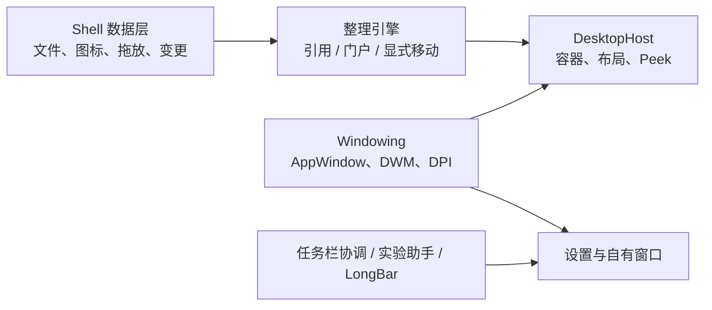

# Long Grid 核心 Windows 能力实现审计

审计日期：2026-07-30
状态：Implementation Proposal
范围：桌面文件整理、桌面容器、任务栏美化、自有窗口视觉、工作空间窗口恢复

## 1. 审计结论

现有文档的方向基本正确，但把几类实现难度完全不同的功能写得过于接近：

1. **显示文件引用**不等于整理真实桌面文件。
2. **绘制桌面容器**不等于把 Explorer 原生图标装进容器。
3. **美化自己的窗口**有正式 API；**修改系统任务栏**没有完整稳定的换肤 API。
4. **记录并恢复其他应用窗口**可以部分实现；**修改其他应用窗口外观**不应做。
5. WinUI 3 适合设置应用，但 DesktopHost 是否适合用 WinUI 3，必须经过透明度、Z-order、Win+D、输入和资源探针。

因此推荐把核心能力拆成四条边界清楚的技术线：



首版可发布路线：

- 设置应用：WinUI 3 + Windows App SDK Stable。
- 容器：Long Grid 自有窗口/合成表面，不注入 Explorer。
- 文件整理：安全引用为默认；真正清理桌面需要用户明确授权的“托管目录移动”。
- 任务栏：默认只协调系统主题；透明/着色放到独立实验助手。
- 高自由外观：做自有 LongBar Dock，而不是接管系统任务栏。

## 2. 必须先解决的产品矛盾

### 2.1 三种整理模式不是同一件事

| 模式 | 磁盘变化 | 原生桌面图标 | 容器内容 | 风险 |
|---|---:|---|---|---:|
| 安全引用 | 无 | 仍然存在，可能重复 | Long Grid 引用 | 低 |
| 托管目录 | 用户确认后移动 | 根桌面减少 | 真实目录 Portal | 中 |
| 原生图标布局 | 不移动 | 由 Explorer 继续绘制 | 只是空间位置被调整 | 高 |

当前 PRD 默认“只保存引用”，却期望用户看到桌面已整理。若原生图标还留在桌面，用户会看到两份入口。这必须在 UI 中明确，不能隐藏这个事实。

### 2.2 推荐的首版组合

**默认：安全引用模式**

- 拖入容器只创建引用。
- 原文件位置不变。
- 首次使用明确提示可能与原生桌面图标重复。
- 适合应用、URL、项目目录和不想移动的资料。

**可选：托管目录模式**

- 为每个容器绑定真实目录，例如 `%USERPROFILE%\Desktop\Long Grid\项目 A`。
- 用户把桌面文件拖入容器时，先显示移动计划、冲突和撤销能力。
- 使用 Shell 文件操作执行移动；规则不得默认自动移动。
- 这是“真正把桌面收干净”的可靠路线。

**实验：原生图标布局模式**

- Windows Shell 的 `IFolderView` 提供读取和设置文件夹视图项目位置的公开接口。
- 但在原生图标后面动态绘制容器背景、可靠处理 Win+D 和 Explorer 重启，仍缺少面向第三方桌面容器的正式宿主 API。
- Phase 0 可以验证，但没有证据前不得承诺 Fences 式无缝集成。

## 3. 桌面文件发现

### 3.1 数据源

不能只扫描 `%USERPROFILE%\Desktop`。桌面可见项至少来自：

- 当前用户 Desktop Directory；
- Public Desktop；
- Shell Desktop Namespace 中的虚拟项；
- OneDrive/企业策略重定向后的桌面位置；
- `.lnk`、`.url` 和非普通文件系统 Shell 项。

实现建议：

1. 使用 Known Folder API 获取用户桌面与公共桌面，不拼接固定路径。
2. 以 `IShellItem`/`IShellItem2` 作为 Shell 边界模型。
3. MVP 只把文件系统项、`.lnk` 和 `.url` 映射为可操作项目。
4. 其他虚拟 Shell 项显示为不支持或只提供打开动作。
5. 用户桌面和公共桌面出现同名项时不能仅按显示名去重。

微软建议新代码使用 Known Folder API；`IShellItem`/`IShellItem2` 是新代码的首选 Shell 项表示。

### 3.2 项目身份

建议领域模型：

```csharp
public sealed record DesktopItemIdentity(
    string Provider,
    string CanonicalTarget,
    string? VolumeId,
    string? FileId,
    string? ParsingName);
```

规则：

- 领域 ID 使用 Long Grid 生成的稳定 UUID。
- NTFS 本地文件可以额外保存 Volume/File ID，辅助识别重命名。
- 路径是可变属性，不是唯一主键。
- PIDL 用于当前 Shell 会话互操作，不作为长期持久化的唯一身份。
- 网络盘、FAT/exFAT、云占位无法取得稳定 File ID 时退回规范化路径。
- `.lnk` 同时保留快捷方式文件自身和解析目标，两者不能混为一个身份。

P0-01c 实测对齐：当前 96 个物理桌面项目的 Volume/File ID 全部读取成功；临时沙箱内文件和目录重命名保持身份，复制产生新身份；72 个现存 `.lnk` 文件目标与链接文件自身身份均不同。由此确认路径只能是可变定位信息。全零/不支持 File ID、硬链接别名、跨卷操作、网络盘和云提供程序仍必须显式降级，不能静默合并。

### 3.3 初始枚举与增量更新

推荐管线：

```text
Known Folder / Shell 枚举
    → 轻量元数据
    → 身份归一化
    → 与本地索引 Diff
    → UI 增量更新
    → 异步图标/缩略图
```

变更监听：

- Shell 语义优先使用 `SHChangeNotifyRegister`。
- 通知可能合并成目录级更新，因此收到 `UPDATEDIR` 后重新 Diff，不能假设每个文件都有一条事件。
- 可用 `FileSystemWatcher` 辅助物理目录，但不能把它当作完整、无丢失的事务日志。
- 启动、休眠恢复、Explorer 重启和监听溢出后必须全量对账。
- P0-02 当前验证基线为 750 ms 静默窗口和 3 s 最大延迟；后续根据 UI 延迟与扫描成本调优。

P0-02 实测进一步确认通知只能作为提示：1,100 次受控沙箱操作只收到 1–4 条 `UPDATEDIR` 类通知，逐项创建、重命名和删除细节被完全合并；触发全量扫描后，三轮都精确恢复 220 个最终项目。生产逻辑不得以事件条数判断完整性，必须使用脏标记、扫描代次和最终对账。

### 3.4 图标、缩略图和属性

- 使用 `IShellItemImageFactory` 获取 Shell 图标或缩略图。
- 先显示类型图标，再异步替换缩略图。
- 缩略图请求必须限并发；排队阶段可取消，已进入原生 `GetImage` 的调用不能安全强杀。
- 缓存未命中和第三方缩略图提供程序放入可回收的低权限工作进程，硬超时通过终止工作进程实现。
- 缓存键至少包含项目身份、修改时间、尺寸、DPI 和主题。
- `HBITMAP`、图标句柄和 COM 对象必须有明确释放策略。
- OneDrive 占位文件默认不因生成缩略图而触发下载。
- 网络目录离线时使用缓存图标和离线徽标，不阻塞 UI 线程。

P0-03a 当前实测：96 个真实桌面项目预热成功，三轮各 500 次后台图标提取全部成功；并发峰值为 4，成功 `HBITMAP` 与 `DeleteObject` 释放数严格一致，预热后 GDI 句柄净增量均为 0。缓存缩略图仅命中 1/13，这属于 `SIIGBF_INCACHEONLY` 的预期语义。P0-03b 进一步用自有临时 BMP 验证受限 Low Integrity 可回收 worker：父进程用 `CreateProcessAsUserW` 和 `DISABLE_MAX_PRIVILEGE` 主令牌挂起启动 worker，查询实际子进程为 Low Integrity（RID `0x1000`），显式只继承 stdin/stdout/stderr 三个句柄，先加入 `KILL_ON_JOB_CLOSE` Job 再恢复主线程；worker 可提取自有 BMP，其主动 write-up 探针被 MIC 阻断。协议 v4 为每个像素请求创建最大 262,144 bytes 的匿名页文件映射，通过 `DuplicateHandle` 向目标 worker 复制不可继承的单次句柄；worker 写入并关闭自己的句柄，父进程按 transport、格式、尺寸、步幅、声明长度、容量及实际内容复核。最新一轮 500/500 成功，p95 21.11 ms，每 100 项回收；250 ms 强制卡死、缺失映射句柄、错误容量、有界输入/输出、畸形 JSON、错误版本和 worker 异常退出均被识别，回收后新 worker 恢复；父进程无清理退出时由 PID 监视和 Job Object 双重兜底回收卡死 worker，连续三次超时按 50/100/200 ms 退避后恢复；2×2 BGRA32/16-byte 与 256×256/262,144-byte 最大负载通过，九类像素/映射故障均拒绝并恢复；峰值约 41.0 MiB/353 handles，750 ms 空闲 CPU 为 0。实际受限 worker 仍可读取未通过 broker 授予的文件；新增零 Capability AppContainer 对照使用 `SECURITY_CAPABILITIES` + 显式 NUL 标准流句柄白名单挂起启动，三个进程均由 `TokenIsAppContainer` 复核并先入 Job：无操作控制和精确 AppContainer SID ACL 授权文件读取成功，相邻未授权文件被拒绝，临时 Profile 删除成功。ADR-0002 的方向获得首个正向隔离证据，但真实缩略图 worker 迁移、单请求 broker、正式渲染集成和真实 provider/支持矩阵仍未关闭，详见[P0-03b 报告](spikes/P0-03b-thumbnail-worker-isolation.md)。

## 4. 文件整理与真实操作

### 4.1 视觉归类

视觉归类只修改：

```text
DesktopItemRef.ContainerId
LayoutSnapshot
RuleEvaluationLog
```

它不得修改文件系统。拖入、跨容器拖动和删除容器都默认属于视觉归类。

### 4.2 托管目录移动

真实移动单独建模：

```text
Collect → Plan → Revalidate → Confirm → Execute → Observe → Journal → Undo
```

必须使用 `IFileOperation` 或等价 Shell 文件操作适配器，而不是直接把所有场景交给 `File.Move`。`IFileOperation` 支持复制、移动、重命名、删除以及进度/错误回调，并取代旧的 `SHFileOperation`。

每个计划至少包含：

- 源与目标 Shell 项；
- 是否跨卷；
- 同名冲突策略；
- 重解析点与符号链接信息；
- 云文件可用性；
- ACL/只读/共享占用检查；
- 预计可撤销方式；
- 操作前身份和时间戳；
- 用户确认版本号。

执行前必须再次验证，避免预览后文件被其他进程替换。

P0-08a 已落地纯 Core `FileOrganizationPlanner` 与临时沙箱 `IFileOperation` 探针。安全引用在模型上不产生文件系统动作；托管移动遇到网络、重解析点、云占位、目标冲突或状态缺失时阻断，合法候选仍要求显式批准。真实 Shell 场景已验证同卷成功移动、冲突不执行、回调取消保持源文件，以及两项批处理中一项完成/一项取消。回调取消在本机返回 `ERROR_CANCELLED`，同时 `GetAnyOperationsAborted` 为 false，证明结果判断必须结合总体 HRESULT、aborted、逐项回调与最终复读。Explorer 撤销栈、跨卷和真实故障矩阵仍为 Inconclusive，详见[P0-08 文件操作安全报告](spikes/P0-08-file-operation-safety.md)。

### 4.3 撤销边界

- 同卷移动：记录新旧身份和路径，优先反向移动。
- 跨卷：本质是复制、校验、删除；撤销能力要明确标注为较弱。
- 覆盖文件：默认禁止；若未来支持，必须先建立可恢复备份。
- 回收站删除：只能在 Shell 报告成功后写入完成日志。
- 网络/云操作：允许部分成功，逐项报告，不伪装成原子事务。
- 自动规则不得在无人确认时覆盖或删除文件。

## 5. DesktopHost 的实现

### 5.1 不使用的方案

- 不把窗口 `SetParent` 到 `Progman`/`WorkerW`。
- 不依赖未文档化消息生成或寻找 WorkerW。
- 不注入 `explorer.exe`。
- 不 Hook Explorer 的桌面 ListView。
- 不把全屏透明窗口简单设为点击穿透后就宣称完成桌面层。

这些方案可能能做出演示，但 Windows 没有承诺其跨版本行为。

### 5.2 应验证的两种自有窗口模型

**模型 A：每个容器一个 HWND**

- 窗口范围只覆盖容器，天然不遮挡其余桌面输入。
- 容器移动、缩放和命中测试直观。
- HWND 数量、无障碍树和多容器合成成本更高。

**模型 B：每显示器一个 HWND**

- 一个 Composition 场景渲染全部容器，动画和批量布局更高效。
- 必须对容器外透明区域做准确命中测试穿透。
- 任何命中、Z-order 或无障碍错误影响整个显示器。

Phase 0 同时测量两种模型，不能仅凭代码量选择。

P0-04/P0-05a 当前证据：100 容器下，每容器模型创建 100 个 HWND，USER 对象峰值从 2 增至 103；每显示器模型创建 1 个 HWND，通过 100 个矩形 Window Region 保留交互岛，USER 峰值只增至 4。两种模型三轮都达到容器内 100/100 命中、空白区 100/100 跨进程穿透、零抢焦点和销毁后资源回基线。下一原型选择每显示器模型，但 Win+D、全屏、Alt+Tab 实际 UI、拖放和 UIA 尚未通过，因此仍为 Conditional Pass。

重要修正：`WM_NCHITTEST` 返回 `HTTRANSPARENT` 只保证继续查找同线程窗口，不能单独作为穿透到 Explorer 的实现。每显示器模型必须使用有官方所有权语义的 Window Region 或后续验证通过的等价公开方案；Region 更新失败时立即隐藏宿主。

### 5.3 窗口状态机

DesktopHost 至少需要：

```text
Hidden
DesktopPassive     桌面可见、非编辑
DesktopEditing     可拖动、缩放、选择
Peek               临时置于普通窗口之上
Suspended          全屏、锁屏或会话不可见
Recovering         Explorer/显示器/DWM 变化后重建
```

规则：

- 普通状态不得 Always-on-top。
- Peek 状态才临时提升 Z-order，并在 Esc/失焦后恢复。
- 检测独占全屏、演示模式和远程会话时默认隐藏或降频。
- 锁定容器仍必须保留键盘和辅助功能入口，不能永久 `NOACTIVATE`。
- 不在 Alt+Tab/任务栏中为每个容器显示按钮。
- Explorer 重启只重建适配器和窗口关系，不重建领域对象。

### 5.4 DPI 与显示器

- 进程声明 Per-Monitor V2 DPI Awareness。
- XAML 布局使用有效像素/DIP；AppWindow 和 Win32 位置使用物理像素，必须集中转换。
- 处理 `WM_DPICHANGED` 并采用系统建议矩形。
- 使用 `QueryDisplayConfig`/`DisplayConfigGetDeviceInfo` 建立显示器拓扑指纹。
- 指纹包含 adapter/target、本地稳定连接身份、工作区、方向、DPI、相对位置；友好名只用于 UI，不能作为身份。
- 显示配置查询返回缓冲不足时重新获取大小并重试。
- 拔屏时只做最小可见性纠正，不覆盖原拓扑快照。

P0-07a 当前证据：在有效 DPI 192/240 的双屏环境中，三轮各 100 次 `EnumDisplayMonitors`/`GetMonitorInfo`/`GetDpiForWindow` 枚举只产生一个拓扑指纹，虚拟屏幕边界与显示器 Bounds 外接矩形一致，USER/GDI/进程句柄无净增长。设备 ID/Key 只在进程内散列，报告不输出原值或散列。

P0-07b1 当前证据：三轮各 100 次 `QueryDisplayConfig` 联合枚举都得到 2 条 active/virtual-mode 路径，与 2 个 monitor 达到 2/2 source-name 映射和 2/2 source Bounds 匹配；路径与拓扑指纹均稳定，当前两个 target 可用、rotation 为 Landscape，且无资源净增长。实现已按官方竞态要求对缓冲不足做最多 8 次重新查询。adapter LUID、target ID、source name、EDID 和 monitor path 均不输出。该结果仍是静态子集；真实旋转、负坐标、缩放/拔插/RDP、`WM_DPICHANGED` 和布局恢复由 P0-07b2 验证。

P0-07b2a 当前证据：Core 恢复规划器的 9 个测试覆盖等价拓扑、整体平移、DPI 变化、唯一相似映射、对称歧义、缺屏、DIP 缩放、最小可见性纠正和非法显示器引用。只有零差异精确映射允许自动计划；相似映射和任何位置纠正必须预览；未解析显示器阻断整个提交。当前实现只生成计划，不代表真实 `WM_DISPLAYCHANGE`/`WM_DPICHANGED`、Window Region、Composition、UIA 或回滚已经通过。

P0-07b2b1 当前证据：Core 稳定器的 12 个测试覆盖静默期、采样间隔、一致/不一致指纹、连续事件总超时、代次失效、漏通知自检、暂停/恢复和时间顺序。默认 750 ms + 250 ms × 2 + 10 s 仅为待实测初值。WindowProc 只应标脏和安排后台工作，不能同步执行 CCD 枚举；计划应用前必须再次核对代次。

P0-07b2b2a 当前证据：真实隐藏顶层窗口三轮各观察 3 秒，均完成 WTS 注册/注销、窗口类注册/注销、2 次专用线程快照和 1 次 Ready 转换；快照失败/stale 为 0，USER `1→1`、GDI `0→0`、进程句柄 `255→255`。初版 `Task.Run` 会让创建 DPI HWND 的线程池线程保留消息队列，因此已改为可 Join 的单一采样线程。当前没有诱发系统变化，DPI 建议矩形和动态代次失效仍未实测。

P0-07b2b2b1 当前证据：Core 事务协调器的 12 个测试覆盖完整批量、幂等/空计划、Blocked、ReviewRequired 审批、提交前与提交中代次失效、适配失败后可能存在部分变更、提交后 Bounds 不一致、补偿回滚成功/失败和不完整原位置快照。负坐标按有符号物理像素原样提交，不按主屏原点裁剪。只有逐窗复读与预期一致且代次仍有效才返回 Applied；回滚也必须复读验证。该结果不证明 `DeferWindowPos` 原生调用、窗口约束、跨线程 HWND、Region、Composition、UIA 或真实硬件变化已经通过。

P0-07b2b2b2a 当前证据：三轮真实 Win32 适配器探针各创建 2 个隐藏、同线程、探针自有的顶层 HWND，执行 4 次成功原生批量调用和 8 次 Bounds 捕获。正常 Apply 与幂等 NoChanges 通过；提交成功后代次失效和先真实移动 1 个窗口再返回失败的两条路径都恢复原 Bounds 并复读验证。每轮负坐标往返一致、窗口始终隐藏、焦点保持、ToolWindow/NoActivate 存在、Topmost 不存在；USER `2→5→2`、GDI `0→0→0`、进程句柄 `259→259→259`。部分失败为受控注入，不是实际观察到的 `DeferWindowPos`/`EndDeferWindowPos` 资源失败；Region、Composition、UIA、跨线程和真实显示动态仍未验证。

P0-07b2b2b2b1 当前证据：三轮各在 2 个隐藏、自有 HWND 上执行 7 次 Region 捕获、6 次事务应用和 11 次成功所有权转移。正常 Region 提交通过；全部应用后代次失效，以及第一窗真实 `SetWindowRgn` 成功后注入失败，都恢复两窗原 Region 并以独立 HRGN 复读验证。初版错误地在所有权转移后继续读取原 HRGN，且简单预热未覆盖 Region 复制/回滚的进程级 GDI 初始化；修正为转移前复制验证快照、完整路径预热和销毁前清空 Region 后，三轮均为 USER `2→5→2`、GDI `8→8→8`、进程句柄 `258→258→258`。失败仍为受控注入；DirectComposition、UIA provider、可见输入和真实显示动态未验证。

P0-07b2b2b2b2 当前证据：隐藏自有 HWND 建立真实 DComp target/visual，正常和代次补偿路径各执行 `SetRoot`、`Commit`、`WaitForCommitCompletion`；真实 `WM_GETOBJECT` Provider 由 `AutomationElement` 客户端复读 generation、AutomationId 和负坐标物理屏幕 BoundingRectangle。Commit 后代次失效会重新提交旧 Root、恢复旧 HWND Bounds，generation 3 未进入 UIA 快照。首版手写 Visual 重载 vtable 发生访问冲突，已删除不必要的属性互操作并改用 Root 切换；第二版因 UIA HWND Host 返回真实窗口 Bounds 而正确 Fail，随后将自有 HWND Bounds 纳入补偿且未放宽判定。正式三轮均为 USER `2→4→2`、GDI `0→0→0`、进程句柄 `329→329→329`。可见内容、Fragment 树、Narrator、四层复合失败和硬件动态仍未验证。

P0-07b2b2b2b3 当前证据：Core 新增 20 个测试，总数 82；固定 Bounds/Region/DComp/UIA 顺序、输入门、全层快照、失败层补偿、四层最终复读、逆序恢复、适配器异常收敛和紧急隐藏。真实隐藏 HWND 三轮分别在四层完成实际改变后注入失败，`4/4` 均 RolledBack；Composition Commit/Wait 后代次失效也恢复，紧急恢复验证失败保持输入关闭并隐藏。首轮真实预热发现 UIA 恢复后立即验证会因 Bounds 尚未恢复而误判，修正为先完成全部逆序 Restore，再统一正序 VerifyRestored。三轮均为 USER `2→4→2`、GDI `6→6→6`、进程句柄 `340→340→340`。其后的可见输入与 Fragment 自动验证见 b4a，Narrator、真实输入、多 HWND 和硬件动态仍未验证。

P0-07b2b2b2b4a 当前证据：一个短时可见、alpha=1、`WS_EX_TOOLWINDOW | WS_EX_NOACTIVATE`、非 Topmost 的自有 HWND，在不移动光标和不注入输入的前提下，三轮均完成 Region 输入门 Open `2/2`、Close 精确跨进程穿透 `2/2`、Reopen `2/2`。真实 `IRawElementProviderFragmentRoot` 暴露两个 Group Fragment，`AutomationElement` Raw View 客户端验证树导航、AutomationId、不透明 RuntimeId 稳定性和物理屏幕 Bounds；关闭时 Provider 点分派为空、UIA 点查询不返回子 Fragment。三轮 USER `2→4→2`、GDI `3→3→3`、进程句柄 `350→350→350`，前台保持。Narrator、真实输入、跨进程辅助技术、多 HWND 和硬件/会话动态仍未验证。

P0-07b2b2b2b4b1 当前证据：既有 DisplayChange 消息窗口新增 9 个固定受控场景和 5–900 秒观察窗口。baseline 取得 Startup、两次一致快照、FinalState Ready、USER `1→1`、GDI `0→0`、进程句柄 `253→253`，为 `Observed Pass`；声明 scale 但不改系统时预期事件缺失，明确返回 `Inconclusive`/exit 4，证明无假阳性。动态模式允许并统计 generation 变化导致的旧快照丢弃，但仍要求快照零失败、最终 Ready、WTS/窗口类/资源闭环。探针只读且报告不含 monitor/GDI 名称、设备路径、adapter/source/target、会话 ID 或拓扑指纹。真实硬件/会话事件、视觉恢复和 Narrator/输入仍未执行。

P0-04/P0-05b1 当前证据：一个可见、非 Topmost、初次不激活但可由用户显式聚焦的 ToolWindow，渲染一个 List 容器和三个内存演示项目。真实 UIA 客户端三轮均验证 Pane/List/ListItem Raw View、Selection/SelectionItem/Invoke Pattern、选择/调用状态以及两类事件；初次展示后和隐藏自动 Pattern 操作后两个检查点均非前台，USER `44→46→44`、GDI `80→80→80`、进程句柄 `614→614→614`。连续运行首轮曾因外部前台自然变化触发相等性假失败；后续又观察到可激活 HWND 在 UIA Pattern 期间可能成为前台，因此自动调用前先隐藏宿主。原型不枚举桌面、不打开外部内容、不注入输入；实际键鼠、Narrator、触控、拖放、DPI/高对比和系统表面仍未验证。

## 6. 自有窗口与视觉效果

### 6.1 设置应用

推荐正式 API 路线：

- `Window.AppWindow`/`AppWindow` 管理顶层窗口。
- 使用系统标题栏或 WinUI `TitleBar` 控件做自定义标题栏。
- 调用 `AppWindowTitleBar.IsCustomizationSupported` 后再启用深度定制。
- 主设置窗口使用 Mica。
- 临时面板、浮层或强调表面使用 Acrylic。
- 高对比度、节能模式或不支持时使用纯色 fallback。

Mica 适合长时间存在的主窗口背景；Acrylic 更适合临时表面。大面积、常驻的透明模糊不应无条件启用。

### 6.2 桌面容器

建议主题：

| 主题 | 实现 |
|---|---|
| 纯色 | WinUI/Composition 半透明或不透明画刷 |
| 清透 | 低 Alpha 色板，不承诺背景模糊 |
| 磨砂 | 支持时使用 Desktop Acrylic；失败回退纯色 |
| 专注 | 高对比不透明表面、降低动画 |

圆角优先使用系统/DWM 的窗口圆角偏好或 XAML Clip；阴影使用系统窗口阴影或 Composition Shadow。不要首版自研屏幕后景采样 Blur。

### 6.3 完全自定义标题栏

必须保留：

- 拖动区域；
- 最小化、最大化、还原、关闭；
- 右键系统菜单；
- Snap Layout 相关系统行为；
- 键盘与 Narrator 名称；
- Caption Button Insets；
- 混合 DPI 后的点击区域。

若只是改颜色，优先保留系统标题栏。只有确实需要搜索框、状态或统一材质时才扩展内容到标题栏。

### 6.4 其他应用窗口

Long Grid 可以做的是“工作空间恢复”：

- `EnumWindows` 收集候选顶层窗口；
- `GetWindowPlacement` 与 DWM Extended Frame Bounds 记录位置；
- 保存显示器、窗口状态和应用身份；
- 启动应用后匹配窗口，再用 `SetWindowPlacement`/`SetWindowPos` 尝试恢复；
- 用公开 `IVirtualDesktopManager` 判断窗口是否在当前虚拟桌面，或移动到已知桌面 ID。

限制：

- 没有稳定公开 API 用于完整枚举、创建和切换所有虚拟桌面。
- 管理员窗口受 UIPI/权限边界影响。
- UWP/打包应用、多窗口应用和单实例应用可能重建新 HWND。
- 不能保证所有应用接受强制大小和位置。
- 不修改其他应用标题栏、圆角、透明度或内部 UI。

因此工作空间恢复是“尽力恢复 + 逐应用报告”，不是强事务。

## 7. 任务栏美化实现

### 7.1 稳定层：ThemeCoordinator

默认启用，只做支持范围内的协调：

- 读取深浅色、强调色、高对比度、透明效果与减少动画设置；
- Long Grid 自有窗口跟随系统；
- 提供跳转 Windows 个性化设置的入口；
- 不静默改注册表，不修改 Explorer。

这能保证产品“看起来统一”，但不能让系统任务栏任意圆角或改变布局。

### 7.2 实验层：TaskbarAppearance.Helper

若要对标 iTop 的 Transparent/Acrylic 预设：

- 单独进程和单独开关，默认关闭；
- 只做透明、着色和最大化时恢复实色；
- 按 Windows build 白名单；
- Explorer 句柄变化后重新探测；
- 应用前保存可恢复状态；
- Helper 崩溃/超时后恢复默认；
- 检测 Windhawk、ExplorerPatcher、StartAllBack、TranslucentTB 等冲突；
- 不注入、不 Hook、不改 Explorer XAML 树。

外部修改任务栏合成属性不是完整、稳定的系统换肤契约，因此必须标为实验能力，不能作为 Long Grid 核心可用性依赖。

### 7.3 自有层：LongBar

真正可控的圆角、Acrylic、动态图标和工作空间入口用自己的 AppBar/Dock：

- `SHAppBarMessage(ABM_NEW/ABM_QUERYPOS/ABM_SETPOS)` 注册屏幕边缘空间；
- 自有 AppWindow/HWND 渲染；
- 可按显示器显示工作空间、应用、文件夹和最近项目；
- 不复制系统托盘、通知中心、输入法和系统时钟；
- 与系统任务栏并存，或提示用户自行开启系统自动隐藏。

LongBar 是工作空间 Dock，不应宣传为系统任务栏替代品。

### 7.4 禁止进入核心产品的路线

- Explorer 进程注入；
- 修改内部 XAML Visual Tree；
- 函数 Hook；
- 窗口 Region 裁剪系统任务栏作为默认功能；
- 安装驱动；
- 依赖 Insider build 的内部结构。

## 8. 推荐模块划分

```text
src/
├─ LongGrid.Core/
│  ├─ DesktopItems/
│  ├─ Containers/
│  ├─ Rules/
│  ├─ FilePlans/
│  └─ Layouts/
├─ LongGrid.Shell/
│  ├─ KnownFolders/
│  ├─ ShellItems/
│  ├─ ChangeNotifications/
│  ├─ Images/
│  ├─ DragDrop/
│  └─ FileOperations/
├─ LongGrid.Windowing/
│  ├─ AppWindows/
│  ├─ Dpi/
│  ├─ Displays/
│  ├─ ZOrder/
│  └─ FullScreenDetection/
├─ LongGrid.DesktopHost/
├─ LongGrid.App/
├─ LongGrid.Taskbar.Contracts/
├─ LongGrid.Taskbar.Helper/
└─ LongGrid.LongBar/
```

建议端口：

```csharp
public interface IDesktopCatalog
{
    Task<DesktopSnapshot> ReconcileAsync(CancellationToken cancellationToken);
    IAsyncEnumerable<DesktopDelta> WatchAsync(CancellationToken cancellationToken);
}

public interface IShellImageService
{
    Task<ShellImage> GetAsync(
        DesktopItemIdentity item,
        ShellImageRequest request,
        CancellationToken cancellationToken);
}

public interface IFilePlanService
{
    Task<FileOperationPlan> PlanAsync(
        IReadOnlyList<FileIntent> intents,
        CancellationToken cancellationToken);

    Task<FileOperationResult> ExecuteAsync(
        FileOperationPlan approvedPlan,
        CancellationToken cancellationToken);
}

public interface IDesktopSurface
{
    Task ApplyLayoutAsync(LayoutSnapshot snapshot, CancellationToken cancellationToken);
    Task SetModeAsync(DesktopSurfaceMode mode, CancellationToken cancellationToken);
}
```

COM/Win32 类型不能泄漏到 Core。

## 9. Phase 0 必做探针

| 编号 | 探针 | 通过门槛 | 失败后的决策 |
|---|---|---|---|
| P0-01 | 用户/Public/重定向桌面枚举 | 与 Explorer 可操作文件项一致，无阻塞 | 缩小支持范围并明确提示 |
| P0-02 | Shell 变更监听 + 对账 | 批量 10,000 变更后最终一致 | 定期对账频率提高 |
| P0-03 | 图标/缩略图 | 主进程 500 项有界加载/句柄闭环、受限 Low Integrity worker、挂起后先入 Job、最小句柄继承、硬超时恢复、显式句柄 broker 的有界共享内存 BGRA32 IPC、写阻断与未授权读取暴露已测；ADR-0002 建议 AppContainer + 文件 broker，正式渲染集成和真实 provider 矩阵待验证 | 完整矩阵前只显示类型图标/缓存缩略图，现场提取保持实验能力 |
| P0-04 | 每容器 HWND | 原生命中/资源已测；Win+D、输入、Alt+Tab、全屏可预测 | 不作为普通容器首选；保留特殊短生命周期窗口 |
| P0-05 | 每显示器 HWND | Window Region 跨进程穿透已测；交互矩阵通过 | Region/无障碍失败则回退每容器或重做输入层 |
| P0-06 | Explorer 重启 | 10 秒内恢复且无重复实例 | DesktopHost 不可发布 |
| P0-07 | Per-Monitor V2 | 静态双屏、CCD、恢复规划、稳定器、消息基础设施、Core/Win32 Bounds、Window Region、DComp/UIA 与四层复合失败已测；可见输入、Fragment 树、动态消息、100%–300% 热切换、旋转/拔插仍需验证 | 重做坐标层 |
| P0-08 | IFileOperation | 同卷移动、冲突、取消和部分成功已测；Explorer 撤销、跨卷与真实故障仍待验证 | 未全部关闭前托管目录退出首版 |
| P0-09 | 原生图标位置 | 读取/恢复稳定，且不依赖 WorkerW | 否则只保留实验记录 |
| P0-10 | 任务栏透明助手 | 支持 build 上可恢复、零 Explorer 崩溃 | 不发布实验模块 |
| P0-11 | 自有 LongBar | 多屏 AppBar 协调、全屏/自动隐藏正确 | 推迟 LongBar |
| P0-12 | 窗口工作空间 | 主流应用恢复并逐项报告失败 | 保持 Phase 4 |

## 10. 验收矩阵

### 桌面与文件

- 用户桌面、Public Desktop、OneDrive 重定向、网络目录；
- `.lnk`、`.url`、无扩展名、超长路径、非法/丢失目标；
- 文件创建、重命名、移动、删除、批量解压和同步冲突；
- 云占位、离线文件、重解析点、权限拒绝；
- 同名文件、大小写差异和不同身份的相同显示名；
- Explorer 与 Long Grid 同时操作后的最终一致性。

### 窗口与显示

- Windows 10/11 的所有最低支持 build；
- x64/ARM64、Intel/AMD/NVIDIA；
- 单屏、多屏、混合 DPI、旋转、HDR、投影、RDP；
- Win+D、Alt+Tab、任务视图、虚拟桌面；
- 游戏全屏、无边框全屏、演示和屏幕共享；
- 锁屏、休眠、显卡驱动重置、DWM/Explorer 重启。

### 外观与无障碍

- 浅色、深色、高对比度、透明效果关闭；
- 节能模式与减少动画；
- Narrator、键盘、焦点可见性和 200% 文本缩放；
- Acrylic/Mica 不支持时的纯色回退；
- 自定义标题栏的拖动、系统菜单、Snap 与 Caption Buttons。

## 11. 当前文档需要修正的地方

1. PRD 必须明确安全引用会产生原生图标重复的可能。
2. “真正整理桌面”需要托管目录与显式文件移动，不能继续写成纯视觉归类。
3. DesktopHost 技术栈在 Phase 0 前仍未定，不能把 WinUI 3 写成已验证结论。
4. 自有窗口美化和修改系统任务栏必须分开表述。
5. 任务栏实验助手不得成为主进程模块。
6. 原生图标位置 API 可以验证，但动态桌面容器层仍是风险点。
7. 工作空间只承诺尽力恢复，不承诺控制所有第三方窗口。

## 12. 官方依据

- [Windows 应用开发与 WinUI 3](https://learn.microsoft.com/windows/apps/)
- [Known Folders](https://learn.microsoft.com/windows/win32/shell/known-folders)
- [IShellFolder](https://learn.microsoft.com/windows/win32/api/shobjidl_core/nn-shobjidl_core-ishellfolder)
- [IFolderView](https://learn.microsoft.com/windows/win32/api/shobjidl_core/nn-shobjidl_core-ifolderview)
- [Shell change notification](https://learn.microsoft.com/windows/win32/api/shlobj_core/nf-shlobj_core-shchangenotifyregister)
- [IShellItemImageFactory](https://learn.microsoft.com/windows/win32/api/shobjidl_core/nn-shobjidl_core-ishellitemimagefactory)
- [Mandatory Integrity Control](https://learn.microsoft.com/windows/win32/secauthz/mandatory-integrity-control)
- [CreateRestrictedToken](https://learn.microsoft.com/windows/win32/api/securitybaseapi/nf-securitybaseapi-createrestrictedtoken)
- [SetTokenInformation](https://learn.microsoft.com/windows/win32/api/securitybaseapi/nf-securitybaseapi-settokeninformation)
- [CreateProcessAsUser](https://learn.microsoft.com/windows/win32/api/processthreadsapi/nf-processthreadsapi-createprocessasuserw)
- [Creating a Child Process with Redirected Input and Output](https://learn.microsoft.com/windows/win32/procthread/creating-a-child-process-with-redirected-input-and-output)
- [Process creation and explicit handle inheritance](https://learn.microsoft.com/windows/win32/procthread/creating-processes)
- [AssignProcessToJobObject](https://learn.microsoft.com/windows/win32/api/jobapi2/nf-jobapi2-assignprocesstojobobject)
- [DuplicateHandle](https://learn.microsoft.com/windows/win32/api/handleapi/nf-handleapi-duplicatehandle)
- [CreateFileMapping](https://learn.microsoft.com/windows/win32/api/winbase/nf-winbase-createfilemappingw)
- [Creating a File View](https://learn.microsoft.com/windows/win32/memory/creating-a-file-view)
- [Shell drag and drop](https://learn.microsoft.com/windows/win32/shell/dragdrop)
- [IFileOperation](https://learn.microsoft.com/windows/win32/api/shobjidl_core/nn-shobjidl_core-ifileoperation)
- [Manage app windows](https://learn.microsoft.com/windows/apps/develop/ui/manage-app-windows)
- [Title bar customization](https://learn.microsoft.com/windows/apps/develop/title-bar)
- [Mica and Acrylic system backdrops](https://learn.microsoft.com/windows/apps/develop/ui/system-backdrops)
- [Rounded corners](https://learn.microsoft.com/windows/apps/desktop/modernize/ui/apply-rounded-corners)
- [Per-Monitor DPI and WM_DPICHANGED](https://learn.microsoft.com/windows/win32/hidpi/wm-dpichanged)
- [QueryDisplayConfig](https://learn.microsoft.com/windows/win32/api/winuser/nf-winuser-querydisplayconfig)
- [Application Desktop Toolbars](https://learn.microsoft.com/windows/win32/shell/application-desktop-toolbars)
- [IVirtualDesktopManager](https://learn.microsoft.com/windows/win32/api/shobjidl_core/nn-shobjidl_core-ivirtualdesktopmanager)

对应的用户操作、信息架构和状态反馈见[交互设计审计与体验规范](09-interaction-design-audit.md)。
