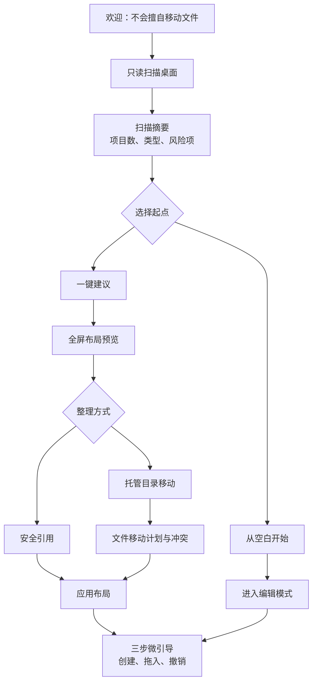

# Long Grid 交互设计审计与体验规范

审计日期：2026-07-30
状态：UX Proposal
主要对标：iTop Easy Desktop
补充参考：Stardock Fences 6、Portals、Nimi Places、PowerToys Workspaces、FancyZones、DropIt

## 1. 审计结论

Long Grid 现有文档定义了功能、安全和技术边界，但还没有形成完整交互系统，主要缺少：

- 首次启动到首次整理成功的完整流程；
- 桌面直操与设置中心之间的职责；
- 容器在普通、编辑、卷起、Peek、恢复时的状态；
- 拖放时“引用、移动、复制、改变归属”的明确反馈；
- 自动整理的模拟、冲突、执行和撤销界面；
- 任务栏实验效果的预览与自动回退；
- 错误、离线、权限拒绝和部分成功状态；
- 键盘、触控和屏幕阅读器的同等操作路径。

推荐体验定位：

> 学习 iTop 的低门槛和即时反馈，学习 Fences 的桌面直操，学习 Portals/Nimi 的目录容器，学习 PowerToys 的预览与逐项状态；所有真实文件变化都增加“先预览、再确认、可撤销”。

Long Grid 不复制竞品界面，而是采用“桌面为主、控制中心为辅”的双表面模型：


## 2. 竞品交互审计

### 2.1 iTop Easy Desktop：主对标

#### 首次启动

iTop 给用户两个入口：

- `Quick Start`：按预设规则自动把桌面项归入 Boxes。
- `Customize`：先把桌面图标对齐，再由用户创建 Boxes。

优点：

- 不要求用户先理解规则系统；
- 首屏就是明确选择，而不是长教程；
- Quick Start 能快速制造“桌面变整齐”的结果。

风险：

- 对真实文件和原生图标做了什么不够透明；
- “智能整理”如果直接应用，容易让用户失去位置记忆；
- 用户可能在理解产品前就接受了大范围变化。

Long Grid 应采用同样的双路径，但改为：

- `一键建议`：扫描并生成布局预览，不立即修改；
- `从空白开始`：保持桌面不变，进入编辑模式。

#### 控制中心

iTop 主导航包含 Boxes、Wallpapers、Personalization、Widgets、AI Assistant。Boxes 内再分：

- Box；
- Appearance；
- Organization；
- Quick Actions；
- Layout；
- Snapshot。

优点是所有能力集中，缺点是桌面整理、内容商城、AI 和系统美化混在同一层级。Long Grid 首版不应复制这种功能跨度。

#### 创建 Box

iTop 提供四种路径：

1. 控制中心点击添加；
2. 在桌面按住鼠标画矩形；
3. 桌面空白处右键；
4. 选中一组图标后右键创建。

这是值得完整吸收的“同一动作多入口”，但结果必须一致，并共用同一个创建命令。

#### Box 编辑

- 点击列表中的 Box 可改名和颜色；
- Appearance 控制标题、颜色、字体；
- Organization 为 Box 配置整理规则；
- Layout 管理分辨率变化；
- Snapshot 备份和恢复；
- 拖动 Box 叠放可合并为标签页。

Long Grid 应把常用编辑留在桌面，低频设置放属性面板，避免用户每次改名都打开控制中心。

#### 任务栏与小组件

iTop Personalization 使用视觉预设卡片降低任务栏配置难度；Widgets 使用逐项开关启用 Schedule、Notes、Clock、Weather 等组件。

值得学习：

- 预设优先于参数；
- 卡片缩略图表达结果；
- 小组件逐个开启，不默认铺满桌面。

需要改进：

- 实验性系统效果必须显示兼容性和恢复状态；
- Widget 开启前应显示网络、账户和权限需求。

来源：[iTop Easy Desktop 用户手册](https://www.itopsoftware.com/user-manual/ied/)

### 2.2 Stardock Fences 6：桌面直接操作

Fences 的关键价值不是设置页，而是容器像桌面本身的一部分：

- 在桌面画矩形创建容器；
- 卷起后只保留标题；
- Peek 临时把容器显示到普通窗口之上；
- Folder Portal 直接浏览目录；
- 拖动容器叠放成标签页；
- Fences 6 支持标签颜色、图标着色和壁纸取色。

Long Grid 应学习：

- 日常操作不离开桌面；
- 标题栏在非编辑状态保持低噪声；
- 卷起、Peek、标签页是空间不足时的三级压缩；
- 拖拽合并必须有清晰高亮和立即撤销。

不应照搬：

- 仅靠悬停触发卷起展开容易误触；默认采用点击展开，悬停作为可选项。
- 深度修改原生图标外观不应成为首版核心。

来源：[Fences 6 发布说明](https://www.stardock.com/news/535945/stardock-releases-fences-6)、[Fences 6 标签页说明](https://www.stardock.com/news/534758/fences-6-beta-lands-with-tabs-icon-tint-and-more)

### 2.3 Portals 与 Nimi Places：目录就是工作表面

Portals 的优势：

- 一个 Portal 可以有多个目录标签页；
- 标题位置、最小化、排序、图标尺寸、边距可调；
- 单个 Portal 可以覆盖全局外观；
- 布局与显示器配置关联；
- 外观配置可以保存成 Profile。

Nimi Places 的优势：

- 图标、缩略图、列表和多列视图；
- 容器内快速搜索；
- 多种排序维度；
- 按时间、位置、虚拟桌面或前台窗口条件显示。

Long Grid 应学习：

- Folder Portal 的面包屑、标签页、排序和视图切换；
- 全局主题 + 单容器覆盖；
- 空目录、离线目录和权限拒绝必须是容器状态，而不是弹窗风暴；
- 情境显示放到高级规则，不默认读取或记录窗口标题。

来源：[Portals 官方功能页](https://portals-app.com/)、[Nimi Places](https://mynimi.net/Projects/Nimi-Places/)

### 2.4 PowerToys Workspaces：复杂任务的可见进度

PowerToys Workspaces 使用：

```text
创建工作空间 → 进入可操作的捕获模式 → 捕获
→ 编辑应用/位置/参数 → 保存 → 启动
→ 逐应用显示成功、进行中、失败 → 完成或取消
```

值得学习：

- 捕获时桌面仍可操作；
- 保存前可以删除应用、改位置、加参数；
- 启动不是黑盒，每个应用都有状态；
- 用户可以取消，失败不会被包装成“全部成功”；
- 重新捕获可回退。

Long Grid 的布局恢复、规则执行和文件批处理也应采用相同的逐项状态模型。

来源：[PowerToys Workspaces](https://learn.microsoft.com/windows/powertoys/workspaces)

### 2.5 FancyZones：编辑器与拖动反馈

FancyZones 的优秀交互：

- 拖动窗口时按住 Shift 显示目标区域；
- 悬停目标立即高亮；
- 模板卡片提供实时预览；
- Grid 模式用分割/合并编辑，Canvas 模式自由移动；
- 鼠标和键盘都能完成编辑；
- 不同显示器可选不同布局；
- 快捷键快速切换布局。

Long Grid 应学习：

- 编辑模式进入后显示吸附线和落点预览；
- 容器布局同时提供模板和自由布局；
- 键盘提供精调与快速移动；
- 应用布局前显示目标显示器。

来源：[PowerToys FancyZones](https://learn.microsoft.com/windows/powertoys/fancyzones)

### 2.6 DropIt：把自动整理变成可理解的规则

DropIt 用“Association = Rule + Action”组织自动化，并用 Profile 隔离不同规则集合。

Long Grid 应学习这个心智模型，但降低术语：

```text
当……条件满足 → 建议/执行……动作 → 放入……容器或目录
```

规则编辑器先提供自然语言摘要和命中样本，高级用户再展开正则、优先级和例外。

来源：[DropIt Associations](https://www.dropitproject.com/dokuwiki/doku.php?id=howto%3Amanage_your_associations)

## 3. Long Grid 体验原则

### 3.1 桌面优先

- 打开项目、拖入、改名、卷起、搜索等高频动作直接在桌面完成。
- 控制中心负责批量、规则、历史、布局、外观和诊断。
- 不为了展示功能而迫使用户进入设置页。

### 3.2 零惊吓

- 首次扫描只读。
- “建议布局”与“应用布局”是两个按钮。
- 真实移动永远显示源和目标。
- 自动操作后持续显示可撤销入口。
- 部分失败按项目报告，不把失败项目从视图中消失。

### 3.3 直接操作 + 可发现替代路径

每个核心动作至少有两条路径：

- 鼠标直接操作；
- 键盘/菜单路径。

桌面手势不能是唯一入口，隐藏功能也不能只靠右键菜单发现。

### 3.4 渐进复杂

- 首屏只展示建议布局和从空白开始。
- 容器属性先展示名称、颜色、布局。
- 规则、条件显示、实例权限等进入高级区域。
- 用户不启用插件、小组件或任务栏实验时，不出现相关干扰。

### 3.5 状态可见

用户随时能回答：

- 当前是否处于编辑模式？
- 拖放会创建引用还是移动文件？
- 哪条规则会处理这个文件？
- 布局属于哪个显示器配置？
- 任务栏实验是否正在生效？
- 最近一次操作是否可以撤销？

## 4. 信息架构

### 4.1 桌面层

常驻但低噪声：

- 容器；
- Portal；
- Widget；
- 编辑模式工具条；
- Peek；
- 临时撤销 Toast；
- 全局搜索浮层。

普通状态不显示大面积工具栏。只有选中或进入编辑模式后显示操作控件。

### 4.2 控制中心

推荐主导航：

| 导航 | 职责 | MVP |
|---|---|---:|
| 概览 | 桌面状态、待处理项、最近操作、快速入口 | 是 |
| 容器 | 容器列表、类型、项目数、批量管理 | 是 |
| 自动整理 | 建议、规则、冲突、模拟结果 | 是 |
| 布局 | 显示器布局、快照、恢复、导入导出 | 是 |
| 外观 | Long Grid 主题、容器预设、自有窗口效果 | 是 |
| 小组件 | Widget 目录、实例和权限 | V2 |
| 工作空间 | 应用捕获、启动和状态 | V2 |
| 设置 | 启动、快捷键、隐私、诊断、实验功能 | 是 |

任务栏实验放在 `设置 → 实验功能 → 任务栏外观`，不与稳定主题混为一个普通外观选项。

### 4.3 容器属性面板

采用右侧非模态属性面板：

```text
常用
├─ 名称
├─ 图标/颜色
├─ 标题显示
├─ 卷起/锁定
└─ 当前类型与文件行为

布局
├─ 尺寸与位置
├─ 吸附
├─ 排序/视图
└─ 显示器与可见条件

自动整理
├─ 关联规则
├─ 新建规则
└─ 最近命中

高级
├─ 标签页
├─ 单容器主题覆盖
└─ 诊断信息
```

修改名称、颜色、透明度时桌面实时预览；关闭面板即保留已提交项，未提交文本编辑可取消。

## 5. 首次启动流程

### 5.1 推荐流程



### 5.2 欢迎页

只表达三个承诺：

- 默认不移动或删除文件；
- 所有建议可先预览；
- 可以随时恢复。

账户、订阅、壁纸商城、插件推荐不能阻塞首次整理。

### 5.3 扫描摘要

显示：

- 桌面项目总数；
- 应用/快捷方式、文件、文件夹、URL 数量；
- Public Desktop 和重定向桌面提示；
- 离线、无权限、失效快捷方式等风险项；
- “扫描没有修改任何文件”。

不显示完整敏感路径，除非用户展开详情。

### 5.4 一键建议

默认建议容器：

- 应用；
- 文件夹；
- 文档；
- 图片与截图；
- 临时/待整理。

预览中可以：

- 改名；
- 拖动容器；
- 把项目拖到其他容器；
- 取消某个容器；
- 切换安全引用/托管目录；
- 查看“将发生什么”。

不能用模糊的“智能整理”掩盖文件操作。

### 5.5 首次成功

应用后只教学三个动作：

1. 在桌面拖拽画框创建容器；
2. 拖入文件时查看“引用/移动”标记；
3. 使用 `Ctrl+Z` 或 Toast 撤销。

其余功能采用上下文提示，不播放长教程。

## 6. 桌面模式与状态

| 模式 | 进入方式 | 可执行动作 | 退出 |
|---|---|---|---|
| Passive | 默认 | 打开、滚动、搜索、切换标签 | 进入编辑/Peek |
| Editing | 托盘、快捷键、容器菜单 | 创建、移动、缩放、合并、删除关系 | 完成/Esc |
| Preview | 应用建议或布局前 | 查看差异、排除项目、切换方案 | 应用/取消 |
| Peek | 快捷键 | 在其他窗口上临时访问 | Esc/再次快捷键 |
| Focus | 用户主动 | 只显示指定容器/工作空间 | 退出专注 |
| Recovery | 系统变化后 | 查看映射和异常 | 接受/调整/回退 |

任何时候只能有一个全局主模式。编辑模式和 Peek 不叠加，避免 Z-order 与输入混乱。

## 7. 容器交互规范

### 7.1 创建

统一支持：

- 桌面拖出矩形；
- 编辑工具条 `+`；
- 桌面空白处菜单；
- 选中项目后“创建容器”；
- 控制中心容器页。

拖出矩形后就地输入名称，默认名称可以根据选中项目建议，但不自动提交规则。

### 7.2 标题栏

Passive：

- 显示标题、项目数/状态、当前标签；
- 控件默认隐藏，悬停或键盘聚焦时出现；
- 双击标题区域卷起/展开应作为可配置行为。

Editing：

- 显示拖动柄、更多菜单、卷起、锁定和关闭关系；
- 边缘显示缩放手柄与吸附线；
- 选中态必须同时使用轮廓和颜色，不能只依赖透明度。

### 7.3 卷起

- 默认点击标题或按钮展开，不默认悬停展开。
- 展开动画 120–180 ms；减少动画时立即切换。
- 卷起后显示异常徽标，例如“2 个项目离线”。
- 键盘焦点不能被隐藏在折叠内容中。

### 7.4 标签页

- 把容器拖到另一个标题栏时显示“合并为标签”目标。
- 进入目标前不得改变布局。
- 松手后合并并显示 Undo。
- 拖标签离开标题栏可拆分成独立容器。
- 每个标签保留自己的数据源、排序和滚动位置。
- 切换标签不应触发文件移动。

### 7.5 空状态

安全引用容器：

> 将应用、文件夹或文件拖到这里。默认只创建引用。

托管目录容器：

> 拖到这里会移动到“目标目录”。松手前会显示操作类型。

Portal：

> 选择一个文件夹，或把文件夹拖到这里。

空状态必须暴露主动作，不能只显示空白矩形。

## 8. 项目与拖放

### 8.1 项目操作

双击遵循 Windows 打开习惯。单击选中。Enter 打开，Space 进入选择模式。

项目菜单：

- 打开；
- 打开所在位置；
- 固定/取消固定；
- 移到其他容器；
- 从容器移除引用；
- 重命名真实文件；
- 属性；
- 删除到回收站。

“移除引用”和“删除文件”必须分组并使用不同图标与文案。

### 8.2 拖放反馈

光标附近必须显示动作徽标：

- `添加引用`；
- `移动文件`；
- `复制文件`；
- `改变归属`；
- `合并标签`；
- `不支持`。

目标容器同时显示：

- 目标名称；
- 目标目录（涉及真实移动时）；
- 冲突数量；
- 是否可撤销。

### 8.3 默认语义

| 来源 → 目标 | 默认动作 |
|---|---|
| Explorer → 安全引用容器 | 添加引用 |
| Long Grid 引用 → 另一个引用容器 | 改变视觉归属 |
| Explorer → 托管目录容器 | 显示移动计划后移动 |
| Portal 项 → 安全引用容器 | 添加引用 |
| Portal 项 → 另一个真实目录 Portal | 遵循 Shell 复制/移动语义并确认 |
| 容器 → 容器标题 | 合并标签 |

不得把修饰键作为理解文件安全的唯一手段；即使支持 Ctrl/Shift，也要显示动作徽标。

### 8.4 批量选择

- Ctrl 增减选择，Shift 范围选择，框选遵循 Windows 习惯；
- 跨容器多选只允许共同动作；
- 批量操作前显示项目数；
- 部分失败后保留失败项选中，便于重试。

## 9. 自动整理

### 9.1 规则编辑器

采用句子结构：

```text
当 [扩展名] [属于] [.png, .jpg]
并且 [创建时间] [在最近] [7 天]
则 [建议放入] [图片与截图]
```

页面分为：

- 条件；
- 动作；
- 作用范围；
- 冲突优先级；
- 命中样本；
- 自动化级别。

自动化级别：

1. 只提示；
2. 自动改变视觉归属；
3. 自动移动真实文件——默认不可选，需单规则授权。

### 9.2 模拟

保存规则前显示：

- 命中数量；
- 前 20 个样本；
- 与其他规则冲突；
- 将改变视觉归属还是磁盘位置；
- 无权限、离线、重解析点等排除项。

零命中不是错误，应提示如何扩大条件。

### 9.3 新文件到达

采用非阻塞通知：

> 发现 6 个新项目，已生成整理建议。

操作：

- 查看；
- 全部接受；
- 逐项调整；
- 暂停该规则；
- 本次忽略。

不在用户演示、游戏全屏或专注模式时弹出抢焦点窗口。

## 10. 布局、快照与恢复

### 10.1 布局编辑器

学习 FancyZones：

- 顶部选择显示器；
- 左侧模板卡片；
- 中央实时预览；
- Grid 与自由 Canvas 两种模式；
- 吸附、间距和安全边界；
- 键盘方向键精调；
- 明确“应用到当前显示器”。

### 10.2 快照

快照卡片显示：

- 名称与时间；
- 显示器拓扑缩略图；
- 容器/项目数量；
- 创建原因：手动、应用布局前、显示器变化前；
- 恢复、比较、重命名、删除。

拓扑缩略图只显示相对位置、方向、缩放和用户可理解的显示器标签；不得暴露 PNP ID、Device Key、adapter LUID、source/target ID、EDID、设备路径或内部路径/拓扑散列。底层身份变化但布局仍可匹配时，恢复差异应说明“检测到新的显示器连接”，而不是展示硬件标识。底层 CCD 查询不完整、映射歧义或缓冲重试耗尽时，恢复界面必须进入“等待显示器稳定”状态，禁止静默套用旧布局。

删除快照进入短期可恢复区，不立即永久删除最后一个有效快照。

### 10.3 恢复差异

```text
已恢复 8 个容器
2 个容器移动到主显示器
1 个目录离线
3 个项目目标丢失
```

操作：

- 接受映射；
- 交换显示器内容；
- 手动调整；
- 回到上一个快照；
- 导出诊断。

恢复差异页必须直接消费 Core 规划状态：

- `Automatic`：仅用于拓扑等价、精确身份且零位置纠正；活动中心仍保留可撤销记录；
- `ReviewRequired`：逐项显示原显示器/目标显示器、requested/proposed 位置和可见性纠正，默认主按钮为“确认恢复”；
- `Blocked`：显示缺失或歧义的用户标签，允许交换、手动映射或取消，禁止“仍然应用已匹配部分”；
- 相似映射不得包装成“已识别同一显示器”；
- 内部稳定 ID、评分和硬件字段不直接呈现给用户。

交互节奏参考 PowerToys Workspaces 的逐项进行中/成功/失败与取消能力；Long Grid 的恢复还必须提供预览和事务回退，不能在后台无提示移动容器。

显示变化期间的恢复界面使用稳定器状态，而不是用固定转圈掩盖不确定性：

- `WaitingQuietPeriod`：“检测到显示器变化，正在等待系统稳定”；
- `Sampling`：“正在确认新的显示器布局”；
- `Paused`：锁屏、会话断开或睡眠期间不显示恢复操作；
- `TimedOut`：“显示器仍在变化，Long Grid 尚未移动任何容器”，提供重试和保持当前布局；
- `Ready`：才进入 Automatic/ReviewRequired/Blocked 规划流程。

新代次到达时必须关闭或标记旧预览已过期；用户不能确认一个基于旧拓扑生成的页面。界面不得显示内部拓扑指纹、代次实现细节或硬件标识。

消息窗口属于不可见基础设施，不得产生任务栏按钮、Alt+Tab 项、通知、焦点变化或可见闪烁。只有稳定器状态跨越用户可感知阈值时才显示恢复反馈；正常启动在约 1 秒内稳定时不弹出“恢复完成”通知。

布局提交只有在逐项复读验证成功后才显示“恢复完成”。提交失败但回滚成功时保持原布局，在活动中心说明“未能应用，已恢复原布局”，不得弹成功 Toast；回滚失败时停止本代次及后续自动恢复，保留现场并显示可操作的高优先级错误，提供“保持当前布局”和“打开恢复详情”，不得循环移动窗口。新显示代次到达时，旧事务即使已经发出批量调用也必须验证并补偿，不得把旧代次结果包装成成功。

批量移动容器不得抢占前台窗口、改变容器 Z-order 或让隐藏恢复窗口短暂出现在任务栏/Alt+Tab。正常提交应表现为同一刷新周期内完成；若后续可见窗口探针发现明显分步跳动，恢复预览必须保留，自动模式不得以动画掩盖非原子中间态。

Region 更新是逐窗立即生效的，中间态可能短暂改变命中区域。DesktopHost 在 Bounds/Region/Composition/UIA 同代事务开始前必须先关闭交互路由；只有全部层验证成功后才重新开放输入。任一层失败时保持输入关闭直至补偿完成；补偿失败则隐藏受影响宿主，不能留下透明的整屏点击拦截层。

系统变化后不得静默把所有容器堆到主屏。

## 11. 外观与任务栏交互

### 11.1 Long Grid 外观

采用预设优先：

- 清透；
- 磨砂；
- 专注；
- 纯色。

选择卡片时在一个示例容器和当前桌面上实时预览。高级区域再提供颜色、透明度、圆角、阴影、标题和图标密度。

若高对比度、节能或系统关闭透明效果，预览必须展示真实 fallback，而不是仍显示理想缩略图。

### 11.2 任务栏实验

首次进入显示：

- 这是实验功能；
- 支持的 Windows build；
- 与已检测任务栏修改工具的冲突；
- “恢复系统默认”入口。

应用流程：

```text
选择预设 → 临时应用 → 15 秒倒计时
→ 保留效果 / 自动恢复
```

预设：

- 系统默认；
- 清透；
- 深色半透明；
- 浅色半透明；
- Acrylic（仅支持时显示）。

不要首屏展示 Alpha、Accent State 或内部参数。高级诊断可显示实际适配器与失败原因。

### 11.3 LongBar

LongBar 首次启用时明确说明它是独立工作空间 Dock，不是系统任务栏。

编辑：

- 拖入应用/文件夹/工作空间；
- 拖动排序；
- 选择显示器和边缘；
- 选择自动隐藏；
- 预览占用的工作区；
- 与系统任务栏冲突时提供解决建议。

## 12. 小组件

学习 iTop 的逐项开启，但增加权限透明度。

Widget 目录卡片显示：

- 名称、来源、预览；
- 数据更新频率；
- 网络/账户/文件/系统权限；
- 支持的尺寸；
- “添加到桌面”。

添加后进入放置模式：

- 显示网格；
- 选择初始尺寸；
- 与容器吸附；
- Esc 取消，不创建半成品实例。

Widget 状态：

- Loading；
- Ready；
- Offline；
- Permission Required；
- Suspended；
- Error；
- Update Required。

错误卡片保留实例位置，提供重试、设置、禁用和移除，不能直接消失。

## 13. 工作空间

学习 PowerToys：

1. `创建工作空间`；
2. 捕获模式保持桌面可操作；
3. 捕获当前候选窗口；
4. 编辑应用、窗口、参数和容器布局；
5. 保存；
6. 启动时逐项显示进度；
7. 用户可取消或跳过失败项。

启动面板状态：

- 等待；
- 正在启动；
- 正在定位；
- 已恢复；
- 已使用现有窗口；
- 需要管理员权限；
- 失败；
- 已跳过。

完成后保留简短总结，不用成功通知遮挡工作区。

## 14. 活动、错误与撤销

### 14.1 即时撤销

改变布局、归属、合并标签、移动文件后显示 Toast：

> 已将 12 个项目整理到“图片与截图”　`撤销`　`查看详情`

Toast 关闭不代表撤销能力消失，活动中心继续保留操作记录。

### 14.2 活动中心

按时间显示：

- 建议；
- 已执行；
- 部分成功；
- 已撤销；
- 无法撤销；
- 系统恢复。

每条记录显示影响范围，不默认暴露完整敏感路径。

### 14.3 错误层级

- **容器内状态**：目录离线、权限拒绝、目标丢失。
- **Toast**：单项非阻塞失败。
- **任务面板**：批量操作、工作空间启动。
- **模态确认**：不可逆、覆盖、权限扩大。
- **安全模式页**：配置损坏或核心适配器无法启动。

不要用模态弹窗处理所有错误。

## 15. 搜索与快速访问

全局快捷键打开搜索浮层：

```text
搜索项目、容器、工作空间和命令
```

结果按类型分组：

- 项目；
- 容器；
- 工作空间；
- 命令；
- Long助手动作。

键盘：

- 上下选择；
- Enter 主动作；
- Ctrl+Enter 打开所在位置；
- Tab 展开次要动作；
- Esc 关闭并恢复原焦点。

搜索默认只索引名称和本地元数据，不索引文件内容，除非用户明确启用。

## 16. 输入与无障碍

### 16.1 键盘基线

| 操作 | 键盘 |
|---|---|
| 进入/退出编辑 | 可配置全局快捷键 / Esc |
| 创建容器 | Ctrl+Shift+N（仅编辑模式） |
| 打开 | Enter |
| 重命名 | F2 |
| 删除关系 | Delete 后明确确认语义 |
| 撤销/重做 | Ctrl+Z / Ctrl+Y |
| 移动 | 方向键；Shift 加速 |
| 缩放 | Alt+方向键；Shift 加速 |
| 切换标签 | Ctrl+Tab / Ctrl+Shift+Tab |
| 搜索 | 可配置全局快捷键 |
| Peek | 可配置全局快捷键 |

不得无条件占用 Windows 已有的系统快捷键。冲突时要求用户选择新组合。

### 16.2 屏幕阅读器

容器名称示例：

> 当前项目，容器，12 个项目，已展开，已锁定。

项目名称示例：

> 需求文档，Word 文档，目标可用，双击打开。

拖放、规则和恢复必须有非视觉替代流程。

### 16.3 触控

- 触控目标至少 40×40 有效像素；
- 长按打开上下文菜单；
- 编辑模式才显示缩放柄；
- 不依赖鼠标悬停；
- 惯性滚动不能误触拖动容器。

## 17. 视觉与动效约束

- 桌面容器默认低对比度，不与壁纸争夺注意力。
- 编辑模式用清晰轮廓提高结构感。
- 常规动画 120–200 ms，布局重排不超过 240 ms。
- 拖放跟手，不对指针路径做延迟平滑。
- Peek 采用统一进入/退出动效，不逐容器随机延迟。
- 减少动画开启时取消位移和缩放，只保留必要淡入淡出。
- 颜色不能是状态的唯一表达。

## 18. MVP 交互优先级

### 必须完成

- 首次扫描、双路径起点和建议预览；
- 桌面创建/编辑/拖放；
- 引用与真实移动的动作徽标；
- 容器空、加载、离线、错误状态；
- 规则模拟和冲突；
- 布局预览、快照、恢复差异；
- Toast 撤销与活动中心；
- 键盘和屏幕阅读器主路径；
- 托盘、全局搜索和诊断入口。

### 可以进入 V1

- 标签页；
- 卷起；
- Folder Portal；
- Peek；
- 主题预设；
- 任务栏实验；
- 高级布局编辑器。

### V2+

- Widget 目录；
- Long助手动作卡；
- 工作空间捕获与启动；
- LongBar；
- 情境显示；
- 跨设备布局。

## 19. 可用性测试

至少用以下任务测试，不给参与者操作提示：

1. 第一次启动，在不移动文件的前提下整理桌面。
2. 判断一次拖放会创建引用还是移动文件。
3. 创建容器并把三个项目加入。
4. 找出刚刚自动整理了哪些项目并撤销。
5. 将两个容器合并成标签，再拆开。
6. 保存布局，模拟拔掉副屏后恢复。
7. 找出一个离线目录为什么不显示内容。
8. 应用任务栏预设后恢复系统默认。
9. 用键盘创建、重命名和移动容器。
10. 启动工作空间并处理一个失败应用。

目标：

- 首次建议预览完成率 ≥ 90%；
- 用户正确识别“引用/移动”的比例 ≥ 95%；
- 首次创建容器中位数 < 60 秒；
- 找到撤销中位数 < 5 秒；
- 无提示恢复布局成功率 ≥ 85%；
- 关键任务键盘完成率 100%。

## 20. 设计交付物

进入 UI 开发前应补齐：

- 信息架构图；
- 首次启动低保真原型；
- Desktop Passive/Editing/Preview/Peek 状态稿；
- 容器、Portal、Widget 的状态矩阵；
- 拖放动作与光标徽标规范；
- 自动整理规则模拟器；
- 布局恢复差异页；
- 活动中心与撤销；
- 浅色、深色、高对比度设计 Token；
- 键盘焦点图和 UI Automation 名称；
- 至少一次 5 人可用性测试报告。

原型、测试和进入实现的门禁遵循[开发流程与交付规范](10-development-workflow.md)中的 UX Prototype、Phase 0 双轨工作法和 Definition of Ready。

## 21. 不能照搬的内容

- 不复制 iTop、Fences 或其他产品的商标、图标、插画、文案和精确视觉资产。
- 不复刻 iTop 的付费墙位置或账户强制流程。
- 不把竞品未公开的文件行为写成事实。
- 不为“看起来一样”牺牲文件操作透明度。
- 不把所有竞品功能同时放进首版导航。
