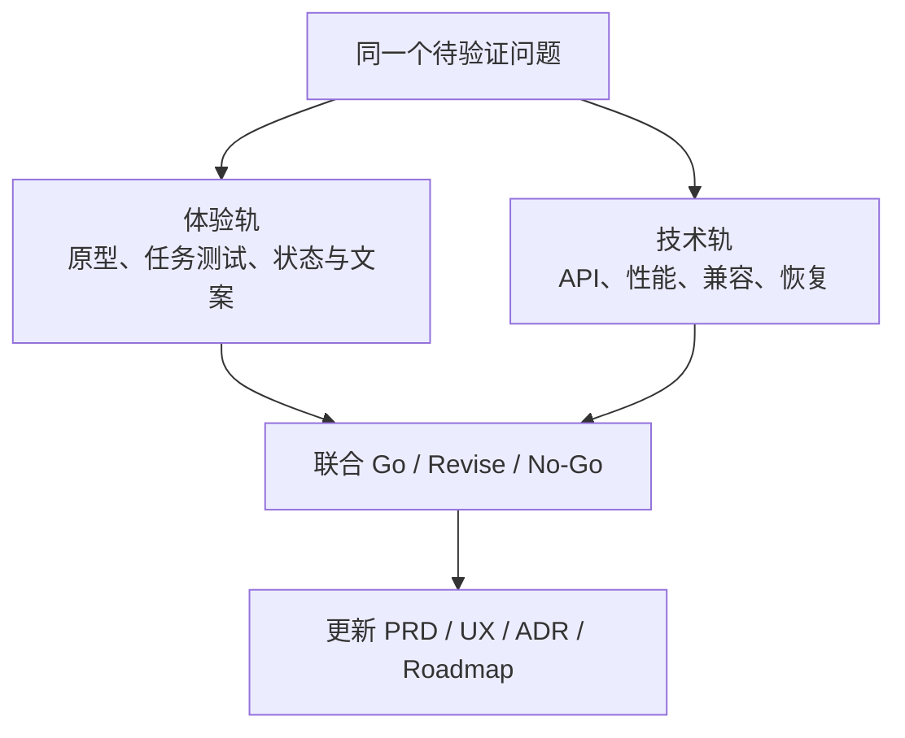

# Long Grid 开发流程与交付规范

版本：1.0
状态：Required
适用范围：Long Grid 产品、Windows 技术探针、Long助手兼容工作、文档与发布

## 1. 目的

本文规定一个需求如何从想法变成可发布能力。它不替代 PRD、交互规范、架构、安全基线或协议，而是规定这些成果以什么顺序产生、由什么证据验收、什么时候可以进入下一阶段。

核心流程：


## 2. 不可违反的原则

1. **先证明高风险假设，再堆功能。**
2. **先定义用户看到的结果，再选择实现。**
3. **文件系统副作用默认关闭，必须预览、确认和记录。**
4. **不以 Explorer 注入、内部 XAML、`Progman/WorkerW` 或驱动作为核心依赖。**
5. **一次 PR 只交付一个可解释的垂直切片或一个明确探针。**
6. **测试、文档和迁移属于功能本身，不是收尾工作。**
7. **实验功能与核心路径隔离，失败时自动回退。**
8. **Long Grid 与 Long助手的共享行为先改协议，再改两端实现。**
9. **没有证据的“应该可以”不能升级为架构结论。**
10. **不因为发布日期临近降低文件安全、隐私、恢复和兼容门槛。**

## 3. 规范与事实来源

| 文档 | 回答的问题 |
|---|---|
| `02-product-requirements.md` | 做什么、不做什么、怎样算产品成功 |
| `09-interaction-design-audit.md` | 用户如何操作、各状态如何反馈 |
| `03-architecture.md` | 模块边界、数据和技术结构 |
| `05-quality-security.md` | 安全、隐私、质量与发布阻断 |
| `08-core-windows-implementation-audit.md` | Windows 能力如何实现、哪些必须探针 |
| `protocol/LONG_WIDGET_PROTOCOL_V1.md` | Long助手/Long Grid 的规范性兼容行为 |
| `adr/*.md` | 已接受的重要技术决策及其后果 |
| 代码与测试 | 当前实现事实 |

发现冲突时：

1. 停止扩大实现范围；
2. 在 PR 中列出冲突文档和具体段落；
3. 涉及产品范围由 PRD 决策，涉及用户操作由交互规范决策；
4. 涉及安全时不得低于质量安全基线；
5. 涉及跨产品行为时不得单方面偏离协议；
6. 需要改变长期技术方向时先提交 ADR；
7. 同一 PR 或前置 PR 修正文档后再继续。

不能在代码注释、聊天记录或 Issue 评论里静默替代正式决策。

## 4. 工作项类型

### 4.1 Discovery

用于竞品、用户问题、平台能力和范围研究。

交付：

- 问题定义；
- 证据来源；
- 已知/未知；
- 建议与不建议；
- 后续需要的探针或原型。

Discovery 不直接授权产品实现。

### 4.2 UX Prototype

用于验证首次启动、拖放、规则、恢复等交互。

交付：

- 目标任务；
- 低/高保真原型；
- 状态和错误路径；
- 无障碍路径；
- 测试脚本；
- 参与者结果；
- 需要修订的交互规范。

### 4.3 Technical Spike

用于验证 Windows、性能或兼容性风险。

交付：

- 单一假设；
- 环境矩阵；
- 最小可丢弃代码；
- 自动化脚本；
- 录像/截图；
- 性能和资源数据；
- Pass/Fail；
- 失败后的替代方案；
- 是否产生 ADR。

Spike 代码不得直接复制进生产模块，除非经过正常设计、审查和测试。

### 4.4 Feature

按用户可验证的垂直切片交付，例如：

> 用户可以创建一个安全引用容器，把一个文件夹引用拖入，并在重启后恢复。

不按纯技术层拆成长期孤立的大 PR，例如“先完成全部数据库层”。

### 4.5 Bug

必须包含：

- 可重复步骤；
- 预期/实际；
- 系统 build、DPI、显示器和安装渠道；
- 数据安全影响；
- 最小回归测试；
- 是否需要迁移或恢复受影响数据。

### 4.6 Protocol Change

适用于 Long助手、插件、Widget、IPC 和共享 Schema。

必须先完成协议变更、版本判断、兼容矩阵和 Golden Fixtures，再开始两端实现。

### 4.7 Release

只整合已经验收的工作，不在发布 PR 中混入新功能。

## 5. 风险分级

| 等级 | 示例 | 必需流程 |
|---|---|---|
| R0 | 文案、无行为的样式修正 | PR + 基础检查 |
| R1 | Core 纯逻辑、非破坏性 UI | 设计/测试 + PR |
| R2 | Shell、窗口、DPI、持久化、插件 | 设计 + 集成测试 + 实机矩阵 |
| R3 | 文件移动、任务栏实验、IPC 权限、升级迁移 | 威胁分析 + 探针 + ADR + 回滚演练 |
| R4 | 删除/覆盖、Explorer 注入、驱动、不可逆格式 | 默认禁止；需重新立项和负责人书面批准 |

风险按最高影响计算。一个 UI 改动若改变文件操作语义，也属于 R3。

## 6. Definition of Ready

功能进入实现前必须满足：

- [ ] 用户问题和目标场景明确；
- [ ] 范围、非目标和验收标准明确；
- [ ] 对应 PRD/交互规范已存在或同一变更中补齐；
- [ ] 引用、移动、删除、权限和网络行为明确；
- [ ] 正常、空、加载、失败、离线和恢复状态明确；
- [ ] 无障碍与键盘路径明确；
- [ ] 风险等级已标记；
- [ ] R2/R3 的技术不确定性已有探针计划或结果；
- [ ] 性能和常驻资源预算明确；
- [ ] 数据格式、迁移、兼容和回滚策略明确；
- [ ] 依赖、许可证和最低系统版本可接受；
- [ ] 不依赖未授权的跨产品变更；
- [ ] 可拆成一个或多个独立验收的 PR。

缺少任一安全关键项时，不得以“先写起来再说”进入实现。

## 7. Phase 0 双轨工作法

Phase 0 同时运行两条轨道：



示例：“把桌面文件拖入容器”：

- 体验轨验证用户能否区分添加引用与移动文件；
- 技术轨验证 Shell 拖放、`IFileOperation`、OneDrive 和撤销；
- 两轨都通过后才能进入 MVP。

体验通过但技术失败：修改体验或缩小范围。
技术通过但用户无法理解：不得发布，先修改交互。

## 8. 技术探针流程

每个探针使用独立工作项和短生命周期分支。

步骤：

1. 用一句可证伪的话定义假设；
2. 固定测试环境和通过阈值；
3. 实现最小实验；
4. 运行正常、边界和恢复场景；
5. 保存原始数据，不只写结论；
6. 写 Spike Report；
7. 评审并选择 `Pass / Conditional Pass / Fail / Inconclusive`；
8. 更新 ADR、架构和路线图；
9. 删除、归档或明确隔离实验代码。

探针报告必须使用 `.github/ISSUE_TEMPLATE/technical-spike.md` 中的结构。长期决策使用 [ADR 模板](adr/0000-template.md)。

`Inconclusive` 不能当作 Pass。需要说明缺少的机器、系统 build、API 或数据。

## 9. 交互设计流程

1. 从 PRD 场景建立任务流；
2. 补全 Loading/Empty/Error/Offline/Recovery；
3. 补全鼠标、键盘、触控和 Narrator 路径；
4. 低保真原型先验证信息和行为；
5. 至少完成一次无提示任务测试；
6. 修订交互规范；
7. 再进入视觉稿与实现；
8. 实现后进行设计走查和真实 Windows 环境验证。

视觉稿不得掩盖技术 fallback。例如 Acrylic 不支持时，设计稿必须包含纯色状态。

## 10. 分支与提交

采用短分支、主干集成：

- `main` 始终保持可构建、可测试；
- 禁止直接向 `main` 推送；
- 分支应在数天内合并，避免长期分叉；
- 大功能使用 Feature Flag 和多个垂直 PR；
- 自动代理创建的分支使用 `codex/` 前缀；
- 人工分支建议使用 `feature/`、`fix/`、`spike/`、`docs/`、`release/`。

提交建议使用 Conventional Commits：

```text
feat(desktop): add reference-container creation
fix(layout): preserve secondary display mapping
spike(windowing): compare per-container and per-monitor HWND
docs(ux): define managed-folder drop confirmation
test(shell): cover coalesced change notifications
```

规则：

- 每个提交保持单一意图；
- 不提交生成目录、个人配置、秘密、签名证书或生产令牌；
- 格式化与行为修改尽量分开；
- 不用无意义的 `update`、`changes`、`fix stuff`；
- 修复回归时在提交或 PR 中关联测试。

## 11. PR 拆分与审查

### 11.1 推荐顺序

高风险功能按以下顺序拆分：

1. 契约/Schema/领域模型；
2. 纯逻辑和单元测试；
3. Windows 适配器；
4. UI 和状态；
5. 集成/实机测试；
6. 发布开关和诊断。

小功能可以合并步骤，但不能省略所需证据。

### 11.2 PR 大小

一个 PR 应能在一次专注审查中理解。若同时改变以下三个以上方面，通常需要拆分：

- 产品行为；
- 数据格式；
- Windows 互操作；
- UI；
- 安全权限；
- 跨产品协议；
- 安装/发布。

### 11.3 必需审查

| 变更 | 必需关注 |
|---|---|
| Core | 领域正确性、幂等、测试 |
| Shell/Windowing | COM/句柄释放、线程、DPI、恢复 |
| 文件操作 | 计划、重验证、冲突、撤销、部分成功 |
| UI | 状态、键盘、Narrator、主题、DPI |
| 协议 | 版本、兼容、Fixtures、两端影响 |
| 安装/更新 | 签名、迁移、回滚、卸载 |
| 隐私/网络 | 数据最小化、权限、关闭路径 |

作者必须使用 PR 模板自检。审查者不能只验证“能运行”，还要验证失败时会怎样。

## 12. 测试层级

### 12.1 PR 必跑

- restore；
- build；
- format；
- 静态分析；
- 单元测试；
- Schema/序列化/迁移测试；
- 依赖漏洞与许可证检查；
- 受影响模块的集成测试；
- 打包结构验证。

### 12.2 Nightly

- Windows Shell 集成；
- 多显示器和虚拟显示器场景；
- 100%/150%/200%/300% DPI；
- Explorer 重启；
- 配置强杀恢复；
- 属性/随机化布局测试；
- UI Automation 冒烟；
- 资源与句柄趋势；
- 开发安装包产出。

### 12.3 Beta/Release

- 支持的 Windows build 和 CPU 架构；
- Intel/AMD/NVIDIA 与 ARM64（若支持）；
- 单屏/多屏、HDR、RDP、休眠；
- 安装、升级、降级、卸载、回滚；
- OneDrive、网络目录、权限拒绝、磁盘满；
- 高对比度、文本缩放、Narrator；
- 24 小时稳定性和性能预算；
- SBOM、签名、哈希与发布说明。

不能把必须实机验证的 Windows 行为伪装成纯 Mock 测试。

### 12.4 受控 Windows 动态矩阵

显示器、DPI、设备、电源、会话、Explorer 和辅助技术场景遵循：

1. 探针默认只观察，不主动旋转、拔插、锁屏、睡眠或建立远程会话；
2. 每次只执行一个固定场景，先记录并最终恢复原系统状态；
3. 自动报告只保存脱敏事件类别、计数、稳定状态和资源数据；
4. 预期通知缺失、机器/设备不具备条件或人工视觉/听读未完成时记为 `Inconclusive`；
5. 只有预期信号、最终稳定、资源闭环和人工检查全部通过，场景才可升级为 Pass；
6. Narrator 朗读、焦点合理性、触控手感和视觉恢复不得由 UIA 属性存在替代；
7. 录像、硬件清单和系统配置若包含可识别信息，放入访问受控的实验记录，不进入仓库或默认诊断包。
8. Issue #20 使用 `eng/Start-Issue20DisplayMatrixSession.ps1` 映射固定 I20 场景并强制恢复计划确认；observer 的 `Observed Pass` 只构成部分证据，最终结论保持 `PendingManualEvidence` 直至人工复核。

### 12.5 UI、启动与打包门禁

建立正式 `LongGrid.App` 后必须维护统一的一键入口，详细合同见[视觉品牌、动效与交付要求](14-visual-branding-and-delivery-requirements.md)：

- `eng/Start-LongGrid.ps1` 负责依赖检查、必要构建和启动，不默认提权或修改真实桌面文件；
- `eng/Pack-LongGrid.ps1` 负责 restore、format、Release build、test、覆盖率、安全探针、包结构和哈希；
- 正式签名秘密只存在于受保护发布环境，不进入脚本、仓库或日志；
- UI PR 必须检查浅色、深色、高对比、文本缩放、减少动画、键盘、Narrator、DPI 和低性能降级；
- UI PR 必须执行 `eng/Test-LongGridUi.ps1 -ContractOnly`；具备可交互 Windows 会话时还要执行完整脚本，并把结构合同与实机结果分别记账；
- 管理窗口 UI PR 必须同时验证默认 DPI 感知尺寸、已审计窄窗口断点、无横向滚动和宽/紧凑状态可逆；窗口 API 的物理像素不得直接冒充 XAML 有效像素；
- AutomationId、访问键和 UIA 冒烟只证明机器可发现与基础交互，不得替代 Narrator 朗读、高对比、文本缩放和视觉检查；
- 动效必须可中断、可降级，不得阻塞输入、隐藏、恢复、回滚或退出；
- 品牌资产必须由矢量母版生成并检查 16–256 px，不提交来源不明或模仿竞品的图标。

## 13. 文档同步矩阵

| 变更 | 必须检查 |
|---|---|
| MVP 范围或行为 | PRD、交互规范、路线图 |
| 用户操作或文案语义 | 交互规范、帮助、测试 |
| 模块/API/数据格式 | 架构、ADR、迁移 |
| Windows 实现策略 | 实现审计、ADR、测试矩阵 |
| 文件/权限/网络 | 安全基线、威胁模型、隐私说明 |
| 插件/Widget/IPC | 协议、Schema、Fixtures、两仓库 |
| 发布渠道/最低版本 | README、PRD、安装与发布说明 |
| 产品名称/视觉/图标/动效 | PRD、交互规范、视觉品牌与交付要求、资产清单 |

PR 描述必须列出“已更新”和“不需要更新”的文档，并说明理由。

## 14. 实验功能流程

任务栏外观、原生图标布局、LongBar、Widget Host 等实验能力必须：

- 独立 Feature Flag；
- 默认关闭；
- 不污染核心配置；
- 能检测支持条件；
- 有超时、熔断和恢复默认；
- 有独立诊断日志；
- 崩溃不影响核心桌面整理；
- 卸载/关闭后恢复系统状态；
- UI 明确标记“实验”；
- 每个支持的 Windows build 单独验证。

若实验需要 Explorer 注入、驱动或内部 XAML，按 R4 处理，不能通过普通 Feature Flag 进入产品。

## 15. Long助手跨仓库流程

任何共享 Manifest、Widget、Bridge 或 IPC 变更按以下顺序：

1. 修改 LPWP 或新建协议提案；
2. 明确版本升级和兼容矩阵；
3. 更新 JSON Schema、DTO 和 Golden Fixtures；
4. Long助手先实现权威执行/权限端；
5. 发布可供 Long Grid 消费的 Contracts/Client/参考包；
6. Long Grid 实现 Surface/Client；
7. 两仓库运行互操作测试；
8. 市场或分发门禁最后启用。

禁止：

- 两边复制相似但不同的 DTO；
- Long Grid 绕过 Long助手权限；
- 先发布带新字段的插件，再更新旧宿主门禁；
- 一个仓库单方面改变已发布错误码或事件语义。

## 16. 依赖与供应链

- 锁定直接依赖和 Windows App SDK Stable 版本；
- 新依赖必须说明用途、大小、许可证、维护状态和替代方案；
- 不为一个简单帮助函数引入大型运行时依赖；
- 禁止生产使用 Preview/Experimental SDK，除非只存在隔离探针；
- 每个 PR 扫描已知漏洞；
- Release 生成 SBOM；
- 构建和打包应可重复；
- 签名证书只存在于受保护发布环境；
- 第三方 GPL 代码复用必须先完成许可证评估。

## 17. Definition of Done

功能完成必须同时满足：

- [ ] 验收场景通过；
- [ ] 正常、空、加载、错误、离线、恢复状态实现；
- [ ] 鼠标、键盘和必要的屏幕阅读器路径可用；
- [ ] 引用/移动/删除等文件语义明确；
- [ ] 单元和集成测试已添加；
- [ ] Windows 实机证据与风险等级匹配；
- [ ] 性能、内存、句柄和空闲 CPU 未超预算；
- [ ] Explorer/DWM/显示器变化后能恢复；
- [ ] 配置和数据迁移可回滚；
- [ ] 日志不包含不必要敏感信息；
- [ ] 文档同步矩阵已执行；
- [ ] Feature Flag、兼容降级和错误提示完整；
- [ ] 无新增发布阻断问题；
- [ ] PR 审查意见已解决；
- [ ] Nightly/Beta 所需后续任务已登记。

“代码已合并”不等于“功能完成”。

## 18. 发布渠道

### Nightly

- 每日或主干变更触发；
- 供开发和自动化测试；
- 可使用开发签名；
- 不承诺配置长期兼容；
- 明确显示构建号和诊断入口。

### Preview

- 面向内部或小范围测试；
- Feature Flag 可见；
- 收集兼容性和性能证据；
- 可以移除尚未承诺的实验。

### Beta

- 功能范围冻结；
- 数据迁移必须向前兼容；
- 只接受缺陷、性能、兼容和文档修复；
- 有已知问题和回滚说明。

### Stable

- 所有发布门禁通过；
- 正式签名；
- 发布说明、SBOM、哈希、隐私说明和回滚路径齐全；
- 不包含默认启用且未经支持矩阵验证的实验功能。

版本采用 SemVer。破坏配置、协议或公开插件契约必须升级主版本；功能增加升级 minor；兼容修复升级 patch。

## 19. 发布阻断与紧急处理

出现质量安全基线中的任一阻断条件立即停止发布。

线上发现高风险问题：

1. 停止扩大发布；
2. 关闭相关 Feature Flag；
3. 提供恢复/回滚步骤；
4. 保留诊断证据；
5. 建立最小回归测试；
6. 修复走正常审查，不直接绕过主干门禁；
7. 发布后完成简短复盘，更新流程或测试矩阵。

涉及用户文件时，优先帮助恢复，不先追求功能继续可用。

## 20. 评审节奏

- 每个 PR：自动门禁 + 同行审查；
- 每周：Phase 0 探针/UX 原型结论；
- 每两周：性能、兼容和风险审查；
- 每个里程碑：范围、DoD、已知问题和回滚评审；
- 每次协议版本：Long助手与 Long Grid 联合兼容评审；
- 每次 Stable：发布准备评审。

## 21. 仓库落地顺序

当前已完成基础解决方案、Core、测试、PR CI、桌面/Shell 数据链、DesktopHost/显示恢复系列探针、首个可交互宿主切片、配置持久化、文件安全与缩略图 worker 探针；截至 PR #72，开发期只读 App 已具备首次整理、匿名容器/项目、拖放语义和两步关系级撤销原型。主干保护要求 `build-test`，CI 强制覆盖率、配置、文件安全、缩略图 worker 与依赖漏洞门禁，旧功能分支已删除；剩余门禁由 `Phase 0 Exit` milestone 与 Issue #19–#24 跟踪，实机与负责人步骤见[Phase 0 出口执行手册](12-phase-0-exit-runbook.md)。多数能力仍为 Conditional Pass。当前事实与详细差距见[开发状态与后续方向审计](11-development-status-and-direction-audit.md)。

后续按以下顺序继续：

1. 按 Issue #23 执行更新后的 5 人无提示测试；首次整理、匿名添加引用、拖放动作语义、两步撤销和恢复差异已形成测试形状，但不得记为真实 Explorer 拖放或硬件恢复；
2. 由负责人确定许可证、支持矩阵、安装渠道、性能预算和首版整理模式；
3. 按 Issue #19 完成键鼠/触控/拖放/Narrator/系统表面人工矩阵；
4. 按 Issue #20 完成动态显示硬件矩阵，只按负责人批准的范围收口 #21–#22；配置剩余边界由 #24 跟踪；
5. 持续产出测试结果、覆盖率和依赖漏洞报告，但不得以新增相邻探针替代体验与人工证据；
6. 根据双轨证据完成 ADR-0001 Go/No-Go；
7. 从最新 `main` 建立只读桌面目录、视觉容器、持久化引用的首个生产垂直切片；
8. DoR/DoD、实机矩阵和安装门禁满足后再扩大 MVP。

2026-08-03 增量说明：为验证只有真实 App 才能承载的 WinUI 构建、主题、启动与关闭合同，允许先建立不读取桌面、不写配置、不连接 DesktopHost 且不形成安装承诺的开发期 `LongGrid.App` UI Shell。它不满足第 8 项“首个生产垂直切片”，不得据此跳过 Issue #19–#24、5 人测试或 ADR-0001 决策；详细边界见[开发期只读 UI Shell 审计](17-ui-shell-readonly-slice-audit.md)。

同日补充：开发期 UI 可以单向消费由 `LongGrid.Core` 构造的不可变能力状态快照，用于替换 XAML 中硬编码的运行状态并验证 `App -> Core` 接线。该快照只能声明未连接/被安全策略关闭的事实，不得持有路径、Shell/COM/Win32 句柄、桌面项目、可变集合或执行委托；UIA 必须暴露机器可判定状态。真实桌面目录、DesktopHost、配置和文件适配器仍受上述门禁约束。详细合同见[Core 只读运行状态接线审计](20-ui-core-readonly-status-contract-audit.md)。

现有 CI 已执行真实 restore/build/test/format/依赖漏洞门禁。任何勾选完成项必须同时能在 `main` 找到代码、测试和报告，不以仅存在于长期功能分支作为完成依据。
