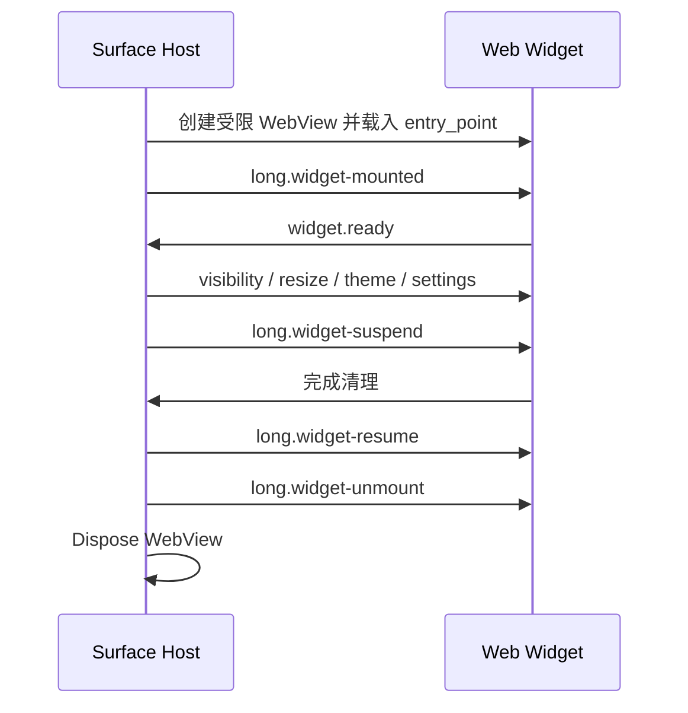

# Long 插件小组件兼容协议（LPWP）1.0

状态：Draft
发布日期：2026-07-30
适用项目：Long助手、Long Grid、Long 插件 SDK、Long 插件市场
建议对应 Long助手 Plugin API：`1.1.0`
协议标识：`long.widget/1.0`

> 本文是 Long助手与 Long Grid 的共同开发契约。它描述目标实现，不代表 Long助手当前 `1.0.0` 已支持小组件。两端只有通过本文的兼容性测试后，才能宣称“兼容 LPWP 1.0”。

## 1. 目标与边界

LPWP 让一个 Long 插件包在不同宿主中按能力安全运行：

- Long助手继续负责插件安装、命令执行、原生能力和独立窗口。
- Long Grid 负责桌面布局、动作卡和 Web 小组件表面。
- 现有插件不修改即可降级为动作卡或“在 Long助手中打开”。
- 新 Web 插件声明 `widgets` 后，可在两个支持该表面的宿主中运行。
- DLL、C# Script 和 WPF 界面不得直接加载进 Long Grid 核心进程。

LPWP 1.0 不包含：

- 跨宿主复用 WPF/WinUI 控件实例；
- 在 IPC 中传输窗口句柄、控件树或任意 CLR 对象；
- 未经用户授权绕过 Long助手能力系统；
- 把所有现有插件自动转换成完整交互式小组件；
- 两个宿主同时写同一插件数据文件。

## 2. 规范用语

本文中的“必须”“禁止”对应 MUST/MUST NOT；“应该”对应 SHOULD；“可以”对应 MAY。

角色定义：

- **插件包**：`.lpak` 解包后的只读代码与资源。
- **Plugin Host**：执行插件命令和高权限能力的宿主，首个实现为 Long助手。
- **Surface Host**：呈现动作卡或 Web Widget 的宿主，Long助手与 Long Grid 都可以实现。
- **Broker**：Long助手提供的同用户跨进程服务。
- **Widget Definition**：Manifest 中的静态小组件定义。
- **Widget Instance**：用户添加到某个桌面或布局中的具体实例。
- **Bridge**：WebView2 页面与当前 Surface Host 之间的消息桥。

## 3. 兼容级别

| 等级 | 插件形态 | Long Grid 表现 | 执行位置 |
|---|---|---|---|
| L0 | 无命令、仅原生 UI | “在 Long助手中打开”卡片 | Long助手 |
| L1 | 声明 `commands` | 自动动作卡、菜单或快捷按钮 | Long助手 Broker |
| L2 | `runtime: webview` 且声明 `widgets` | 原生桌面小组件表面 | Long Grid WebView2 沙箱 |
| L3 | Web UI + 原生数据/命令 | Widget UI + Broker 调用 | 两端分离 |

Long Grid 必须支持 L0/L1 的安全降级，才可以启用 L2。LPWP 1.0 不允许 DLL、C# Script 或 WPF 主界面直接成为 L2 Widget。

## 4. 版本模型

以下版本必须独立维护：

| 字段 | 示例 | 含义 |
|---|---|---|
| `protocol_version` | `1.0` | LPWP/IPC 线上协议版本 |
| `api_version` | `1.1.0` | Long 插件 API 版本 |
| `host.version` | `0.8.0` | Long助手或 Long Grid 产品版本 |
| Manifest `version` | `2.3.1` | 单个插件版本 |
| `min_api_version` | `1.1.0` | 插件要求的最低 API |

兼容规则：

1. 协议主版本不同必须拒绝连接。
2. 协议主版本相同，接收方必须忽略其能够安全忽略的未知可选字段。
3. Long 插件 API 延续“主版本相同，宿主 minor 不低于插件要求”的规则。
4. 使用 `widgets` 的插件必须声明 `min_api_version: 1.1.0` 或更高。
5. 破坏 Manifest、Bridge 或 IPC 语义的修改必须升级协议主版本。

## 5. Manifest 扩展

### 5.1 顶层字段

在现有严格 Manifest 中新增可选字段：

```json
{
  "widgets": [
    {
      "id": "system-status",
      "title": "系统状态",
      "description": "显示 CPU、内存和网络状态",
      "entry_point": "widgets/system-status/index.html",
      "icon": "assets/system-status.svg",
      "multiple_instances": false,
      "default_size": { "columns": 4, "rows": 3 },
      "min_size": { "columns": 2, "rows": 2 },
      "max_size": { "columns": 8, "rows": 6 },
      "refresh": {
        "mode": "event",
        "hidden_behavior": "suspend"
      },
      "appearance": {
        "transparent": true,
        "host_chrome": true
      }
    }
  ]
}
```

机器可读定义见 [long-widget.schema.json](long-widget.schema.json)，完整示例见 [hardware-monitor-widget.manifest.json](examples/hardware-monitor-widget.manifest.json)。

### 5.2 Widget Definition

| 字段 | 必需 | 约束 |
|---|---:|---|
| `id` | 是 | 插件内唯一，`^[a-z][a-z0-9._-]{1,63}$`，发布后不可改 |
| `title` | 是 | 1–80 字符，可被本地化资源替换 |
| `description` | 否 | 最多 240 字符 |
| `entry_point` | 是 | 相对路径，只能指向包内 `.html` 文件 |
| `icon` | 否 | 相对路径，只能指向包内静态资源 |
| `multiple_instances` | 否 | 默认 `false` |
| `default_size` | 是 | Long Grid 网格单位，不是像素 |
| `min_size` | 否 | 不得大于 `default_size` |
| `max_size` | 否 | 不得小于 `default_size` |
| `refresh` | 否 | 刷新与隐藏策略 |
| `appearance` | 否 | 透明背景和宿主框架偏好 |
| `settings_schema` | 否 | 实例级设置定义，不包含秘密默认值 |

尺寸范围为 1–24 个网格单位。Surface Host 可因屏幕空间缩小实际尺寸，但必须通过 `long.widget-resized` 告知页面。

### 5.3 刷新策略

- `event`：默认值，Widget 在数据变化或宿主事件后刷新。
- `interval`：仅用于无法事件化的数据，`interval_seconds` 必须为 5–86400。
- `manual`：仅由用户或 `widget.invalidate` 触发。

隐藏行为：

- `suspend`：默认；隐藏后停止脚本中的非必要工作，宿主可冻结或销毁 WebView。
- `throttle`：保留页面，但宿主把刷新频率限制到不高于每分钟一次。
- `continue`：只允许有明确后台理由且通过资源策略审查的插件。

### 5.4 Manifest 验证

Long助手必须同时更新：

1. `plugin-manifest.schema.json`；
2. Manifest DTO 和反序列化器；
3. 打包器与市场生产校验器；
4. 插件模板、SDK 类型和文档；
5. 单元测试、集成测试与兼容性夹具。

校验器必须验证：

- Widget ID 在插件内唯一；
- `entry_point` 和 `icon` 解析后仍位于插件根目录；
- 引用文件存在并计入包文件总账和 SHA-256；
- 尺寸关系有效；
- `runtime` 为 `webview`；
- `min_api_version >= 1.1.0`；
- 不认识的字段按当前严格 Schema 拒绝，并返回准确 JSON 路径。

旧版 Long助手会因严格 Schema 拒绝带 `widgets` 的包，因此插件市场必须按最低 API 阻止投递给旧宿主。

## 6. Host 能力协商

### 6.1 `host.getInfo`

Bridge 新增无权限方法 `host.getInfo`：

请求：

```json
{ "id": "req-1", "method": "host.getInfo", "args": {} }
```

响应：

```json
{
  "id": "req-1",
  "result": {
    "protocol_version": "1.0",
    "api_version": "1.1.0",
    "host": {
      "id": "long-grid",
      "version": "0.1.0"
    },
    "surfaces": ["widget", "action-card"],
    "features": [
      "widget.instance-state",
      "widget.visibility",
      "widget.resize",
      "theme.v1",
      "locale.v1"
    ],
    "limits": {
      "instance_state_bytes": 262144,
      "bridge_message_bytes": 1048576
    }
  }
}
```

`host.id` 的标准值为 `long-assistant` 和 `long-grid`。插件必须按 `features` 检测能力，不得仅凭产品版本猜测。

现有 `app.getVersion` 保留，不能改变其响应以冒充新接口。

### 6.2 不支持时的行为

- 不支持 `widget` surface：显示动作卡或“在 Long助手中打开”。
- 不支持可选 feature：插件隐藏相应 UI，不能崩溃。
- 不支持协议主版本：宿主显示明确的不兼容原因，不能尝试执行。
- Long助手未安装或未运行：Long Grid 显示“需要 Long助手”，不得静默安装或提权启动。

## 7. Web Widget Bridge

Bridge 延续现有 `{id, method, args}` 与 `{id, result|error}` 结构。

### 7.1 Widget 到宿主的方法

| 方法 | 权限 | 用途 |
|---|---|---|
| `widget.ready` | 无 | 页面完成首屏准备 |
| `widget.getInstanceState` | 无 | 读取本实例状态 |
| `widget.setInstanceState` | 无 | 原子替换本实例状态 |
| `widget.openSettings` | 无 | 请求宿主打开实例设置 |
| `widget.invalidate` | 无 | 请求宿主安排下一次刷新 |
| `widget.setBadge` | 无 | 设置短文本或状态点 |

这些方法只在 Widget 上下文中存在。宿主必须从受信上下文注入 `plugin_id`、`widget_id` 和 `instance_id`，不得相信页面自行提交的身份字段。

`widget.ready`：

```json
{
  "id": "ready-1",
  "method": "widget.ready",
  "args": { "content_version": 1 }
}
```

`widget.setInstanceState`：

```json
{
  "id": "state-1",
  "method": "widget.setInstanceState",
  "args": {
    "state": { "selectedView": "cpu", "compact": false }
  }
}
```

实例状态必须是 JSON，UTF-8 编码后不得超过 256 KiB。宿主必须原子写入。插件共享状态继续使用既有 `storage.local`，不得混用。

### 7.2 宿主到 Widget 的事件

事件统一通过 `window` 事件派发：

```javascript
window.addEventListener("long.widget-resized", (event) => {
  const { width, height, columns, rows, scale } = event.detail.payload;
  renderResponsiveLayout({ width, height, columns, rows, scale });
});
```

事件信封：

```json
{
  "protocol_version": "1.0",
  "plugin_id": "com.long.hardware-monitor",
  "widget_id": "system-status",
  "instance_id": "293c60d7-f0b0-4689-8070-b0b72dc8e18d",
  "sequence": 12,
  "payload": {}
}
```

标准事件：

| 事件 | 关键 payload | 语义 |
|---|---|---|
| `long.widget-mounted` | context、theme、locale、size | 实例建立；每次 WebView 生命周期一次 |
| `long.widget-visibility-changed` | `visible`, `reason` | 可见性变化 |
| `long.widget-resized` | 像素尺寸、网格尺寸、DPI scale | 用户或显示器改变尺寸 |
| `long.widget-theme-changed` | theme、tokens、contrast | 主题/对比度变化 |
| `long.widget-locale-changed` | locale、direction | 语言或书写方向变化 |
| `long.widget-settings-changed` | settings、revision | 实例设置提交 |
| `long.widget-suspend` | reason、deadline_ms | 停止计时器、动画和非必要请求 |
| `long.widget-resume` | reason | 恢复前重新拉取易过期数据 |
| `long.widget-unmount` | reason | 最终清理；必须可重复调用 |

同一实例的 `sequence` 必须单调递增。插件必须忽略小于等于已处理序号的重复事件。`unmount`、`suspend` 和 `resume` 处理必须幂等。

### 7.3 生命周期时序



要求：

- 宿主应在页面导航完成后发送 `mounted`。
- 页面应在 5 秒内调用 `widget.ready`；超时显示可重试占位符。
- 隐藏超过 30 秒时，宿主默认发送 `suspend`。
- 内存压力下宿主可以在保存实例状态后销毁 WebView。
- 恢复后页面不能假设 JS 堆仍存在。

## 8. Web 安全模型

Widget 是不受信内容。两个宿主必须实现同等安全边界：

1. 使用稳定的受控 HTTPS 虚拟来源，例如 `https://<plugin-hash>.longplugin.local/`，或等价的 WebView2 请求拦截；不得依赖裸 `file://`。
2. 所有主文档、脚本、样式、字体和图片默认只能来自当前插件包。
3. 默认 CSP 至少为：

   ```text
   default-src 'self'; script-src 'self'; style-src 'self' 'unsafe-inline';
   img-src 'self' data:; font-src 'self'; connect-src 'none';
   object-src 'none'; frame-src 'none'; base-uri 'none'; form-action 'none'
   ```

4. 禁止远程脚本、`eval`、任意 iframe、新窗口、下载和自定义协议导航。
5. 外网访问必须走既有 `network.http` Host API，由能力系统、域名策略和审计日志控制。
6. 外部链接必须交给宿主确认后在默认浏览器打开。
7. Bridge 只对受信插件源启用，并验证 WebMessage 来源、会话、实例和消息大小。
8. 插件目录只读；实例状态、缓存和日志使用独立命名空间。
9. Release 构建默认关闭 DevTools；开发模式必须有显著提示。
10. WebView 进程崩溃不得导致 Explorer、Long Grid 或 Long助手崩溃。

Long助手当前仅限制顶层本地导航，这不足以满足 Widget 沙箱；实现 LPWP 前必须补齐子资源拦截、虚拟来源和 CSP。

## 9. Long助手 Broker IPC

### 9.1 责任

Broker 是 Long Grid 调用现有插件命令的唯一标准通道。它：

- 枚举已安装且已启用的插件/命令；
- 执行、取消命令并返回结构化结果；
- 请求 Long助手打开插件原生界面；
- 做能力、权限、生命周期、超时和错误映射；
- 不向 Long Grid 暴露插件 DLL、服务对象或 WPF 控件。

### 9.2 传输

首个实现使用 Windows Named Pipe：

- Pipe 只允许当前登录用户 SID；
- 名称包含 SID 的不可逆哈希和协议主版本；
- 默认不接受跨用户、跨会话或管理员/普通用户跨完整性级别连接；
- 消息采用 4 字节小端长度前缀 + UTF-8 JSON；
- 单帧最大 1 MiB；
- 连接建立后必须先完成 `host.hello`；
- 日志不得记录访问令牌、剪贴板内容或完整敏感参数。

若两个进程完整性级别不同，默认拒绝并提示用户以相同权限运行；不得自动提权。

### 9.3 信封

请求：

```json
{
  "protocol": "long.plugin.ipc/1.0",
  "id": "05bbca5a-1c22-4180-9045-b8c2b7e0740b",
  "kind": "request",
  "method": "command.invoke",
  "deadline_ms": 10000,
  "payload": {
    "plugin_id": "com.long.hardware-monitor",
    "command_id": "refresh",
    "arguments": {}
  }
}
```

成功响应：

```json
{
  "protocol": "long.plugin.ipc/1.0",
  "id": "05bbca5a-1c22-4180-9045-b8c2b7e0740b",
  "kind": "response",
  "result": {
    "status": "completed",
    "output": { "message": "已刷新" }
  }
}
```

错误响应：

```json
{
  "protocol": "long.plugin.ipc/1.0",
  "id": "05bbca5a-1c22-4180-9045-b8c2b7e0740b",
  "kind": "response",
  "error": {
    "code": "capability_denied",
    "message": "插件未获得 network.http 权限",
    "retryable": false
  }
}
```

### 9.4 方法

| 方法 | 说明 |
|---|---|
| `host.hello` | 版本、宿主、feature、限制协商 |
| `health.ping` | 存活与延迟检测 |
| `plugin.catalog.list` | 枚举可公开的插件、命令和兼容状态 |
| `plugin.catalog.get` | 读取一个插件的公开元数据 |
| `command.invoke` | 调用命令 |
| `command.cancel` | 取消仍在执行的请求 |
| `plugin.open` | 在 Long助手中打开插件 UI |

`plugin.catalog.list` 不得返回插件秘密设置。图标应返回受 Broker 控制的资源 URI 或经过校验的只读文件引用。

### 9.5 标准错误码

- `incompatible_protocol`
- `invalid_request`
- `unauthenticated`
- `host_unavailable`
- `plugin_not_found`
- `command_not_found`
- `instance_not_found`
- `capability_denied`
- `surface_not_supported`
- `timeout`
- `cancelled`
- `rate_limited`
- `plugin_crashed`
- `internal_error`

未知错误码按 `internal_error` 处理。调用方只能在 `retryable: true` 时自动重试，并使用指数退避。

### 9.6 超时与取消

- `deadline_ms` 范围为 100–120000，默认 10000。
- Broker 必须把取消传递到插件调用链；无法取消时仍应丢弃迟到结果。
- 同一插件默认最多 4 个并发命令，宿主可降低限制。
- Pipe 断开后必须取消该连接所有未完成请求。

## 10. 包、安装与数据所有权

第一阶段不迁移 Long助手现有目录。推荐步骤：

1. 两项目先共享 Manifest/IPC 契约包和测试夹具；
2. Long助手仍是插件安装、升级、签名和激活状态的唯一写入者；
3. Long Grid 通过 Broker 读取目录信息，不直接扫描或修改 Long助手插件目录；
4. L2 Widget 可从 Broker 获得经校验的只读包版本和入口；
5. 后续再迁移到共享只读包缓存。

长期建议目录：

```text
%LocalAppData%\Long\
├─ PluginPackages\<plugin-id>\<version>\     # 只读、内容寻址
├─ LongAssistant\                            # 助手激活状态与数据
├─ LongGrid\                                 # 布局与 Widget 实例状态
└─ Logs\
```

规则：

- 同一包版本内容不可原地修改。
- 激活版本指针必须原子更新，可回滚。
- 两宿主的用户设置、缓存、数据库和日志分离。
- 卸载包前必须检查两个宿主的引用。
- 删除用户数据必须是单独的显式选择。
- 插件升级后，实例设置迁移失败必须回滚或保留旧数据副本。

## 11. C# 共享契约建议

共享契约项目不得引用 WPF、WinUI 或具体宿主：

```csharp
public sealed record WidgetDefinition(
    string Id,
    string Title,
    string EntryPoint,
    WidgetSize DefaultSize,
    string? Description = null,
    string? Icon = null,
    bool MultipleInstances = false,
    WidgetSize? MinSize = null,
    WidgetSize? MaxSize = null,
    WidgetRefreshPolicy? Refresh = null,
    WidgetAppearance? Appearance = null);

public sealed record WidgetSize(int Columns, int Rows);

public sealed record WidgetRefreshPolicy(
    string Mode = "event",
    int? IntervalSeconds = null,
    string HiddenBehavior = "suspend");

public sealed record IpcEnvelope(
    string Protocol,
    Guid Id,
    string Kind,
    string? Method,
    int? DeadlineMs,
    JsonElement? Payload,
    JsonElement? Result,
    IpcError? Error);
```

建议包边界：

```text
Long.PluginContracts          Manifest DTO、版本、错误码、JSON Source Generation
Long.PluginValidation         Schema 与语义验证，不依赖 UI
Long.PluginIpc                帧协议、客户端/服务端抽象
LongBetterWindows.HostAdapter WPF/Long助手实现
LongGrid.HostAdapter          WinUI/Long Grid 实现
```

共享包采用多目标或最低共同 TFM，禁止反向引用任一桌面应用。

## 12. TypeScript SDK 建议

```ts
export interface LongHostInfo {
  protocol_version: string;
  api_version: string;
  host: { id: "long-assistant" | "long-grid" | string; version: string };
  surfaces: string[];
  features: string[];
  limits: Record<string, number>;
}

export interface WidgetEvent<T> {
  protocol_version: string;
  plugin_id: string;
  widget_id: string;
  instance_id: string;
  sequence: number;
  payload: T;
}

const host = await long.invoke<LongHostInfo>("host.getInfo", {});
if (host.surfaces.includes("widget")) {
  await long.invoke("widget.ready", { content_version: 1 });
}
```

SDK 必须提供 Mock Host，使插件作者可以测试主题、缩放、暂停、恢复、断网和权限拒绝。

## 13. UI 与交互约束

- 拖动、缩放、关闭、锁定、层级和吸附由 Long Grid 的宿主框架负责。
- Widget 页面不得自行移动顶层窗口或截获全局拖动。
- `host_chrome: false` 只是视觉偏好；编辑模式下宿主仍可强制显示操作框。
- Widget 必须响应 100%–300% DPI、键盘导航、屏幕阅读器、高对比度和减少动画。
- 最小可点击目标建议为 32×32 有效像素。
- 透明 Widget 必须保证文字在浅色和深色壁纸上可读；宿主可以加材质或遮罩。
- 插件名称、权限来源和错误状态必须可查看，不能伪装成系统 UI。

## 14. 兼容降级矩阵

| 条件 | Long Grid 行为 |
|---|---|
| 旧插件有 `commands` | 生成动作卡 |
| 旧插件仅有 WPF UI | 显示“在 Long助手中打开” |
| 新插件含 `widgets`，宿主支持 | 创建 Web Widget |
| 新插件含 `widgets`，Long Grid 版本过低 | 阻止添加并显示最低版本 |
| Long助手未运行 | 展示离线状态与启动按钮 |
| Long助手未安装 | 展示依赖说明，不静默安装 |
| 权限被拒绝 | 保留卡片并显示可恢复错误 |
| 插件崩溃 | 隔离失败，提供重试/禁用，不影响桌面 |
| Widget 包文件校验失败 | 拒绝加载并要求 Long助手修复/重装 |

## 15. 实施顺序

### 15.1 Long助手

**LA-0：契约**

- 将 Plugin API 升到 `1.1.0`。
- 增加 Widget DTO、Schema 和语义校验。
- 更新 `.lpak` 校验、模板、SDK、文档和市场兼容门禁。
- 提取无 UI 的 `Long.PluginContracts` 与验证测试夹具。

**LA-1：Web Widget 能力**

- 增加 `host.getInfo` 和 Widget Bridge 方法/事件。
- 实现虚拟 HTTPS 来源、子资源拦截、CSP 和实例身份绑定。
- 更新 Web SDK、Mock Host 和 UI Kit 响应式变量。

**LA-2：Broker**

- 实现同用户 Named Pipe、握手、限长帧和稳定错误码。
- 实现 catalog、invoke、cancel、open 和 health 方法。
- 将权限检查保留在 Long助手端。

**LA-3：参考插件**

- 提供一个低风险 Web Widget 示例。
- 覆盖事件顺序、状态恢复、暂停、DPI、主题和语言。
- 生成签名 `.lpak` 供两端持续集成使用。

**LA-4：发布**

- 市场展示 Widget surface、宿主版本和新增权限。
- 灰度启用 Broker，提供禁用开关和诊断日志导出。

### 15.2 Long Grid

**LG-0：契约消费者**

- 引用相同版本的 Contracts、Schema 和测试夹具。
- 实现 Manifest 只读模型，不执行插件代码。

**LG-1：动作卡**

- 实现 Broker 客户端、离线状态、命令调用/取消。
- 从现有 `commands` 自动生成动作卡。

**LG-2：Web Widget Host**

- 实现受控 WebView2 来源、Bridge、生命周期和实例状态。
- 由布局引擎拥有 chrome、移动、缩放和持久化。

**LG-3：资源治理**

- 可见性暂停、内存压力回收、崩溃重建和速率限制。
- 多显示器、虚拟桌面、DPI、Explorer 重启后恢复。

**LG-4：扩展**

- 在真实需求出现后再设计数据订阅 Provider；不纳入 LPWP 1.0。

## 16. 一致性测试

两项目必须引用同一套 Golden Fixtures。至少覆盖：

### Manifest

- 合法单实例和多实例 Widget；
- 路径穿越、绝对路径、缺失入口、重复 ID；
- 非 Web runtime 声明 Widget；
- 尺寸越界或 min/default/max 关系错误；
- 旧 API 宿主拒绝并返回准确原因。

### Bridge

- `mounted → ready → resize → suspend → resume → unmount`；
- 重复/乱序事件；
- 非受信来源、伪造实例 ID、超大消息；
- 状态达到 256 KiB 边界；
- 页面超时、导航、渲染进程崩溃。

### IPC

- 同用户连接成功、其他用户拒绝；
- 协议不兼容、畸形长度、超大帧；
- 超时、取消、断线和迟到响应；
- 权限拒绝、插件不存在、插件崩溃；
- 并发限制与重试退避。

### UI/资源

- 100%/150%/200%/300% DPI；
- 浅色、深色、高对比度、减少动画；
- 多显示器拔插与任务栏位置变化；
- 隐藏后 CPU/网络明显下降；
- Long助手或 Long Grid 单独升级/回滚；
- Explorer、WebView2 和 Broker 分别重启。

## 17. 发布门槛

只有全部满足才可标记 `LPWP 1.0 Compatible`：

- 两端通过相同 Manifest、Bridge 和 IPC 测试夹具；
- 现有不含 `widgets` 的插件安装/运行回归通过；
- 权限仍由 Long助手统一裁决；
- Long Grid 不加载第三方 DLL/Script/WPF；
- Widget 隐藏、挂起或销毁后无持续非必要任务；
- 一个插件崩溃不会带崩 Explorer 或任一宿主；
- 包签名、文件总账和路径边界验证生效；
- 升级、降级、卸载和用户数据保留均有测试；
- 用户能看到插件来源、权限、宿主依赖和错误原因。

这里的“完美兼容”是**协议级兼容与确定性降级**，不是强行让每一种旧 UI 在两个技术栈中像素级复用。

## 18. 变更治理

- 本文与 Schema 必须进入两个仓库的版本控制。
- 行为修改先提交协议 PR，再提交两端实现 PR。
- 新增可选字段需附 Golden Fixture；新增必需字段必须升级主版本。
- 错误码和事件名发布后不得复用为其他含义。
- 每次发布记录：协议版本、Plugin API、最低两端版本、迁移说明。
- Long助手是插件执行与权限裁决的权威；Long Grid 是桌面实例布局与展示状态的权威。

## 19. Long助手执行清单

把本文交给 Long助手开发任务时，可直接使用以下验收指令：

1. 不修改现有 `1.0.0` 插件语义，新增能力使用 Plugin API `1.1.0`。
2. 先实现共享 DTO、Schema、校验器和测试，再实现 UI。
3. Manifest 继续严格验证；`widgets` 只能用于 `webview`。
4. 实现受控来源和 CSP 后，才允许 Widget 被 Long Grid 加载。
5. Broker 仅暴露 DTO，不暴露进程内对象；权限在 Long助手端二次校验。
6. 提供 Long Grid 可消费的 Contracts 包、IPC 客户端契约和签名参考插件。
7. 用本文第 16、17 节作为完成定义，并输出测试结果与未实现差异。
